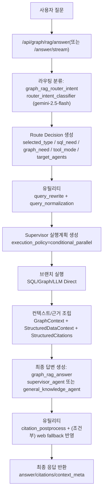
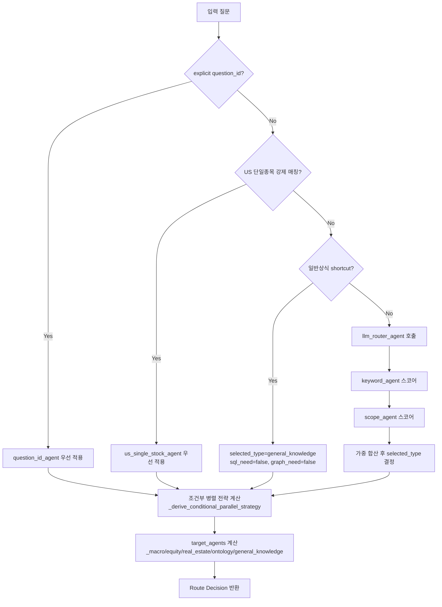
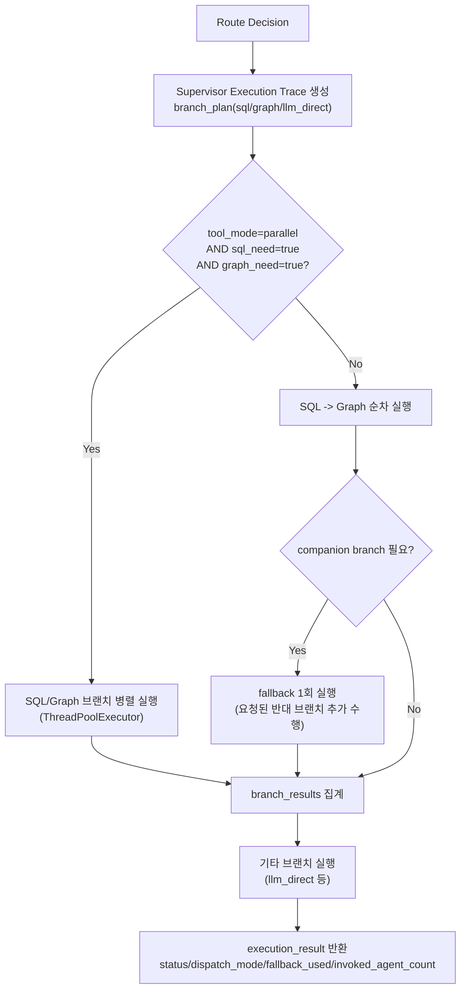
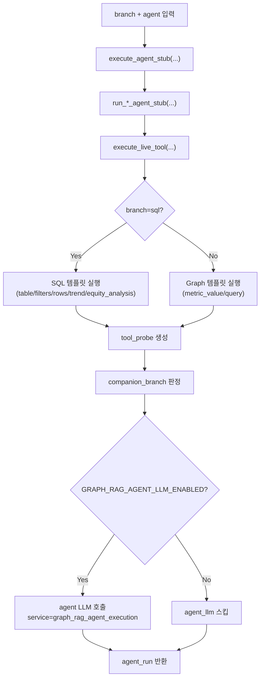
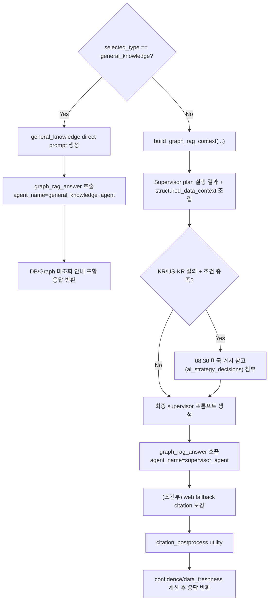

# 챗봇 멀티에이전트 워킹 로직 (현재 구현 기준)

기준 코드:
- `/Users/ssho/project/hobot-service/hobot/service/graph/rag/response_generator.py`
- `/Users/ssho/project/hobot-service/hobot/service/graph/rag/agents/__init__.py`
- `/Users/ssho/project/hobot-service/hobot/service/graph/rag/agents/live_executor.py`
- `/Users/ssho/project/hobot-service/hobot/service/graph/rag/templates/__init__.py`

적용 범위:
- `/api/graph/rag/answer`
- `/api/graph/rag/answer/stream`

---

## 1) 구성 요약

- 라우팅은 `router_intent_classifier(gemini-2.5-flash)`가 담당하며, 규칙 기반(`keyword_agent`, `scope_agent`) 결과와 함께 최종 `selected_type`을 결정한다.
- Supervisor 실행 정책은 `conditional_parallel`이다.
- `sql_need=true` + `graph_need=true`인 경우 SQL/Graph 브랜치를 병렬 실행한다.
- 각 브랜치에서 도메인 에이전트(`macro/equity/real_estate/ontology`)가 먼저 도구(SQL/Neo4j)를 실행하고, 이후 에이전트 전용 LLM 요약(`graph_rag_agent_execution`)을 수행한다.
- 최종 답변은 Supervisor LLM(`graph_rag_answer`, `supervisor_agent`)이 생성한다.
- `general_knowledge` 질의는 내부 DB/그래프 컨텍스트를 생략한 direct 경로를 탄다.
- Query Rewrite / Query Normalization / Citation Postprocess 유틸리티는 실제로 LLM 호출되고 로그가 남는다.

---

## 2) 개략적인 큰 흐름 (High-Level)

---

## 3) 세부 흐름 (Detailed)

### 3.1 라우팅/실행전략 결정

핵심 결정 규칙:
- 기본적으로 `tool_mode = parallel`은 `sql_need && graph_need`일 때만 허용된다.
- `real_estate_detail` 기본값은 SQL 우선(`sql=true`, `graph=false`)이며, 질문 키워드에 따라 graph 필요가 승격될 수 있다.
- `general_knowledge`는 `sql=false`, `graph=false`, `target_agents=[general_knowledge_agent]`로 고정된다.

---

### 3.2 Supervisor 브랜치 실행 (조건부 병렬 + fallback)

fallback 트리거:
- 브랜치 결과에 `needs_companion_branch=true`가 있으면 반대 브랜치를 추가 1회 실행한다.
- 예: SQL만 수행했는데 에이전트가 graph 보조근거 필요로 판정한 경우.

---

### 3.3 브랜치 내부: 도메인 에이전트 1회 실행 순서

도메인별 특징:
- `equity_analyst_agent` SQL 결과에 `equity_analysis` 포함:
  - MA20/MA60/MA120
  - 단기/장기 추세 분류
  - 골든/데드크로스
  - 실적 이벤트 전후 반응(`earnings_reaction`)
- `real_estate_agent` SQL 결과에 `trend_analysis` 포함:
  - 월별 시계열(최대 N개월)
  - 시작 대비 가격/거래량 변화율
  - 지역 scope label(법정동코드 → 지역명)
- `ontology_master_agent` graph 브랜치에서 Cypher 방향성 검증 메타 포함.

---

### 3.4 최종 합성 경로 (일반 경로 vs 일반상식 경로)

---

## 4) 에이전트/모델/데이터 소스 매핑

| 구분 | 에이전트 | 기본 모델 | 주 데이터 소스 | 로그 서비스명 |
| --- | --- | --- | --- | --- |
| 라우팅 | `router_intent_classifier` | `gemini-2.5-flash` | 질의 텍스트 | `graph_rag_router_intent` |
| 도메인 | `macro_economy_agent` | `gemini-3-flash-preview` | MySQL(FRED/ECOS/KOSIS), Neo4j | `graph_rag_agent_execution` |
| 도메인 | `equity_analyst_agent` | `gemini-3-flash-preview` | MySQL(OHLCV/재무), Neo4j | `graph_rag_agent_execution` |
| 도메인 | `real_estate_agent` | `gemini-3-flash-preview` | MySQL(부동산 집계/실거래), Neo4j | `graph_rag_agent_execution` |
| 도메인 | `ontology_master_agent` | `gemini-3-flash-preview` | MySQL(뉴스/이벤트), Neo4j | `graph_rag_agent_execution` |
| 일반상식 | `general_knowledge_agent` | `gemini-3-flash-preview` | 내부 지식(컨텍스트 미조회) | `graph_rag_answer` |
| 최종합성 | `supervisor_agent` | `gemini-3-pro-preview` | GraphContext + 브랜치 결과 + 인용 | `graph_rag_answer` |
| 유틸리티 | `query_rewrite_utility` | `gemini-2.5-flash` | 질문/라우트 메타 | `graph_rag_query_rewrite` |
| 유틸리티 | `query_normalization_utility` | `gemini-2.5-flash` | 질문/요청 파라미터 | `graph_rag_query_normalization` |
| 유틸리티 | `citation_postprocess_utility` | `gemini-2.5-flash` | citation compact list | `graph_rag_citation_postprocess` |

---

## 5) 모니터링 화면에서 보이는 호출 체인

동일 `flow_run_id` 내에서 일반적으로 아래 순서가 보인다.

1. `graph_rag_router_intent`
2. `graph_rag_query_rewrite` (활성 시)
3. `graph_rag_query_normalization` (활성 시)
4. `graph_rag_agent_execution` (대상 에이전트 수만큼)
5. `graph_rag_answer`
6. `graph_rag_citation_postprocess` (활성 시)

참고:
- `tool_mode=parallel`이면 SQL/Graph 브랜치 에이전트 실행 로그가 거의 같은 시각에 발생할 수 있다.
- `general_knowledge` 경로에서는 컨텍스트 빌드가 생략되고 direct answer 중심 로그만 남는다.

---

## 6) 스트리밍 API 동작 요약

- `/api/graph/rag/answer/stream`도 내부적으로는 동일한 멀티에이전트 파이프라인을 모두 실행한다.
- 완료된 최종 텍스트를 chunk로 나눠 `delta` 이벤트로 전달한다.
- 즉, 현재 구현은 "최종 응답 생성 후 chunk 스트리밍" 구조다(토큰 단위 실시간 생성 스트리밍 아님).
