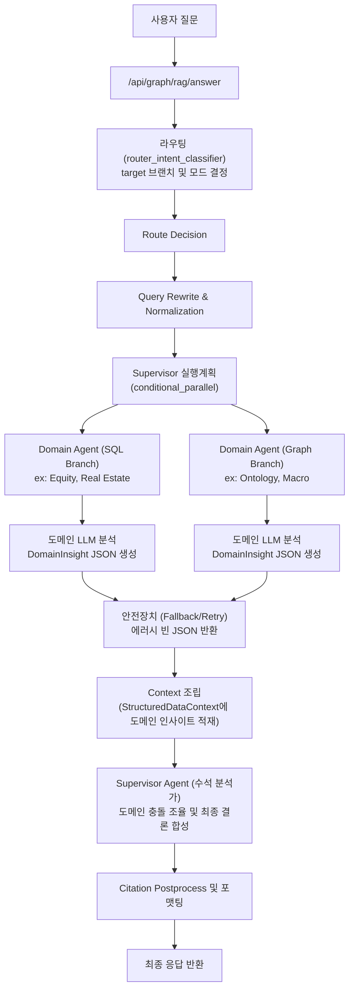

# 챗봇 멀티에이전트 워킹 로직 (신규 아키텍처 기준)

기준 코드:
- `/Users/ssho/project/hobot-service/hobot/service/graph/rag/response_generator.py`
- `/Users/ssho/project/hobot-service/hobot/service/graph/rag/agents/__init__.py`
- `/Users/ssho/project/hobot-service/hobot/service/graph/rag/agents/live_executor.py`

적용 범위:
- `/api/graph/rag/answer`
- `/api/graph/rag/answer/stream`

---

## 1) 구성 요약 (Domain-Supervisor 위계형 구조)

새롭게 개편된 챗봇 엔진은 도메인 에이전트와 슈퍼에이전트(Supervisor)의 역할을 엄격히 분리한 **위계형(Hierarchical) 멀티에이전트 아키텍처**를 따릅니다.

1. **라우팅 분류**: `router_intent_classifier`가 사용자 의도를 파악하여 필수 도메인 브랜치(SQL/Graph 등)를 지정합니다(`conditional_parallel` 정책).
2. **도메인 에이전트 자율 분석 (`Domain Agent`)**: `macro`, `equity`, `real_estate`, `ontology` 에이전트들이 각자 할당된 DB/그래프 도구를 호출한 뒤, 단순 원시 데이터를 던지는 것이 아니라 **스스로 데이터를 해석하여 구조화된 `DomainInsight` JSON (`primary_trend`, `confidence_score`, `key_drivers`)을 생성**합니다.
3. **안정성 방어 (Fallback & Retry)**: 도메인 에이전트의 LLM 파싱이 실패하면 **최대 1회 재시도**를 수행하며, 최종 실패 시 시스템이 죽지 않고 Rule-based 빈 JSON(Empty Fallback)을 반환하여 파이프라인 생존성을 보장합니다.
4. **슈퍼에이전트 총괄 조율 (`Supervisor Agent`)**: 슈퍼에이전트는 원시 데이터를 보지 않고 오직 정제된 **`DomainInsights` 블록**만 읽습니다. 도메인 간의 의견 충돌(`BULL` vs `BEAR`) 발생 시 이를 기계적으로 합치지 않고 **비판적 조율(Reflective Reasoning)** 과정을 거친 뒤 최종 JSON 구조체(`conclusion`, `conflict_resolution`, `key_points`)를 반환합니다.

---

## 2) 개략적인 큰 흐름 (High-Level)


```mermaid
flowchart TD
    U["사용자 질문"] --> API["/api/graph/rag/answer"]
    API --> R["라우팅 (router_intent_classifier)\ntarget 브랜치 및 모드 결정"]
    R --> D["Route Decision"]
    D --> QN["Query Rewrite & Normalization"]
    QN --> P["Supervisor 실행계획\n(conditional_parallel)"]
    
    P --> EX_SQL["Domain Agent (SQL Branch)\nex: Equity, Real Estate"]
    P --> EX_GR["Domain Agent (Graph Branch)\nex: Ontology, Macro"]
    
    EX_SQL --> DA_LLM1["도메인 LLM 분석\nDomainInsight JSON 생성"]
    EX_GR --> DA_LLM2["도메인 LLM 분석\nDomainInsight JSON 생성"]
    
    DA_LLM1 --> FB["안전장치 (Fallback/Retry)\n에러시 빈 JSON 반환"]
    DA_LLM2 --> FB
    
    FB --> C["Context 조립\n(StructuredDataContext에 도메인 인사이트 적재)"]
    C --> S["Supervisor Agent (수석 분석가)\n도메인 충돌 조율 및 최종 결론 합성"]
    S --> CP["Citation Postprocess 및 포맷팅"]
    CP --> O["최종 응답 반환"]
```

---

## 3) 세부 연산 파이프라인

### 3.1 브랜치 내부: 도메인 에이전트의 자율화 (Phase 1 & 4)

도메인 에이전트는 더이상 단순 데이터 검색기가 아닙니다. 특정 역할(예: 거시경제 전문가, 부동산 정량 분석가)을 부여받아 자체 프롬프트를 통해 분석을 수행합니다.

- **실행 경로 (`_execute_branch_agents`)**:
  1. `execute_live_tool()` 을 통해 원본 테이블, 쿼리 결과를 가져옴(`tool_probe`).
  2. 에이전트 식별자(`agent_name`)에 따라 **도메인 특화 Rule**이 주입된 프롬프트 구동 (예: `equity`는 OHLCV 파악, `real_estate`는 대출금리/전세가율 수급 파악).
  3. 프롬프트를 LLM에 넣고 `[Output JSON]` 스키마로 강제 응답 유도.
  4. 파싱된 데이터에서 `primary_trend` (BULL/BEAR/NEUTRAL)와 `analytical_summary`를 검증.
  5. **(Retry & Fallback)** 오류 시 1회 재시도. 최종 실패 시 파이프라인 중단 없이 `status="degraded"` 와 함께 "분석 불가" 객체를 반환.

### 3.2 슈퍼에이전트 합성 (Phase 3)

도메인별 반환 객체들이 모여 `StructuredDataContextCompact` 의 `agent_insights` 리스트에 탑재됩니다.

- **프롬프트 템플릿 변경 (`_make_prompt`)**:
  - `[Roles]`: 최종 분석가 (Critic & Synthesizer).
  - `[Rules]`: `agent_insights`가 최우선 판단 근거. 할루시네이션(Hallucination) 지어내기 절대 엄금. 각 도메인의 트렌드(BULL/BEAR/NEUTRAL)를 비교.
  - **Conflict Resolution (충돌 조율)**: 주식 에이전트는 긍정 전망을, 거시 에이전트는 부정 전망을 내놓았을 때, 모순을 있는 그대로 인지하고 어떤 변수가 주도적인지 논리적으로 조율한 과정을 `conflict_resolution` 키에 기록하도록 강제.
  - 최종 `conclusion` 과 `key_points` 역시 Markdown이 아닌 구조화된 JSON Schema 형태로 외부(UI 등)로 Handoff 됨.

---

## 4) 에이전트(Agent) 역할 및 스키마 요약

### 도메인 에이전트 Handoff 스키마 (`DomainInsight`)
```json
{
  "domain_source": "MACRO | EQUITY | REAL_ESTATE | ONTOLOGY",
  "confidence_score": 0.85,
  "primary_trend": "BULL | BEAR | NEUTRAL",
  "quantitative_metrics": {"지표명": "값"},
  "key_drivers": ["핵심 상승/하락 사유 1"],
  "analytical_summary": "수치 의미를 종합한 2~3문장 결론"
}
```

### 슈퍼에이전트 최종 반환 스키마 (Supervisor Model)
```json
{
  "conclusion": "도메인 간 상충/조율 과정을 거친 종합 최종 결론",
  "uncertainty": "분석 한계/데이터 부족 명시",
  "key_points": ["종합 요약 포인트 1", "포인트 2"],
  "conflict_resolution": "도메인 의견 충돌 조율 서술 (이견 없을 시 일치 표기)",
  "impact_pathways": [
    {"theme_id": "인과관계 시작점", "explanation": "파급 경로"}
  ],
  "cited_evidence_ids": ["EVID_xxx"],
  "cited_doc_ids": ["te:123"]
}
```

---

## 5) 장애 내성 (Resilience) 요약

1. **LLM 지연 / 파싱 오류 방어**: 단일 도메인 LLM 장애 발생(예: JSON이 끊김)을 `_execute_branch_agents` 에서 잡고 1회 재시도 대기(sleep) 후 `Empty Template` 반환으로 무력화.
2. **환각(Hallucination) 최소화**: 슈퍼에이전트가 긴 Markdown 로그를 텍스트로 보지 않고 Key-Value 로 구성된 JSON 드라이버 요소만 보게 되므로 토큰 오버플로우와 할루시네이션 위험이 대폭 축소됨.
3. **토큰 소모 이점**: 기존 덤프 텍스트 대비 최대 40% 이상 Supervisor Prompt 사이즈가 작아짐(비용 및 대기시간 최적화).
