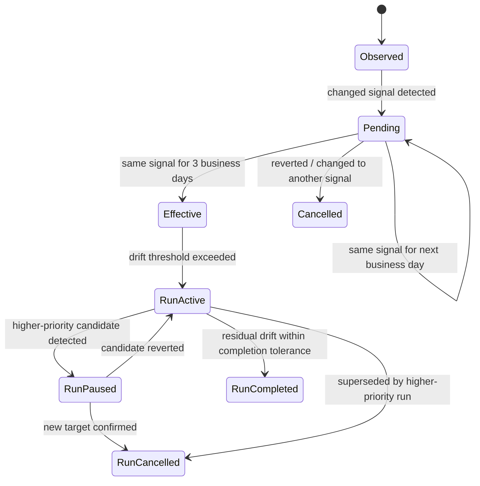

# 자동 리밸런싱 전환 설계서 (2026-03-08)

## 1. 목적

현재 매크로 트레이딩 리밸런싱은 AI 분석은 자동 스케줄로 돌고 있으나, 실제 리밸런싱 실행은 수동 트리거에 가깝습니다. 본 문서는 현재 코드 구조를 기준으로 다음 요구사항을 만족하는 자동 리밸런싱 설계를 정의합니다.

1. MP 또는 Sub-MP 변경이 발생하면, 그 변경 내용이 3일 연속 동일하게 유지될 때만 리밸런싱을 시작한다.
2. 리밸런싱은 5거래일에 걸쳐 분산 집행한다.
3. 5일치 주문을 첫날에 미리 고정하지 않고, 매일 최신 스냅샷을 다시 찍어 남은 수량을 재계산한다.
4. 리밸런싱 도중 MP/Sub-MP 변경, MP/Sub-MP 임계치 충돌, 체결/시세/현금/시장 상태 예외를 모두 운영 가능한 상태머신으로 처리한다.
5. 리밸런싱 상태와 설정은 사용자별로 독립 관리한다.

본 문서는 "구현 제안서"이며, 아직 코드 변경은 포함하지 않는다.

## 2. 현재 코드 기준 현황

### 2.1 이미 자동화된 부분

- `hobot/service/macro_trading/scheduler.py`
  - `setup_ai_analysis_scheduler()`가 매일 `08:30`에 `run_ai_strategy_analysis()`를 등록한다.
- `hobot/service/macro_trading/ai_strategist.py`
  - `run_ai_analysis()`가 AI 분석을 수행하고, 결과를 `ai_strategy_decisions`에 저장한다.

즉, "신호 생성"은 이미 자동이다.

### 2.2 아직 수동인 부분

- `hobot/main.py`
  - `POST /api/macro-trading/run-ai-analysis`: 관리자 수동 AI 분석
  - `POST /api/macro-trading/rebalance/test`: 사용자 수동 리밸런싱 테스트
- `hobot/service/macro_trading/rebalancing/rebalancing_engine.py`
  - 항상 "최신 1건의 AI 결정"을 바로 목표 포트폴리오로 사용한다.
  - 3일 안정화 규칙이 없다.
  - 5일 분할집행 상태가 없다.
  - 진행 중 리밸런싱을 중단/재개/승격/병합하는 상태머신이 없다.

### 2.3 현재 스키마 한계

- `ai_strategy_decisions`
  - AI 일일 판단 이력 저장에는 적합하다.
  - 하지만 "확정된 목표(active target)"와 "관찰된 후보(pending signal)"를 분리하지 못한다.
- `rebalancing_state`
  - 현재 컬럼은 `target_date`, `status`, `current_phase`, `details` 수준이라서 다중 실행(run), scope 분리(global/local), pause/resume, day index, supersede 관계를 표현하기 어렵다.

결론적으로 현재 구조는 "최신 판단 1건 기준의 즉시형 리밸런싱"에는 맞지만, 이번 요구사항의 "3일 안정화 + 5일 적응형 분할집행 + 충돌 처리"에는 부족하다.

### 2.4 현재 멀티유저 상태

현재 코드는 멀티유저 기반이 부분적으로만 반영되어 있다.

- 사용자 계좌/잔고/주문은 이미 `user_id` 기준이다.
  - `get_balance_info_api(user_id)`
  - `get_user_kis_credentials(user_id)`
  - `execute_rebalancing(user_id)`
  - `account_snapshots.user_id`
- 반면 전략 신호와 리밸런싱 상태는 아직 전역 성격이 강하다.
  - `ai_strategy_decisions`에 `user_id`가 없다.
  - `rebalancing_config`는 전역 설정이다.
  - `rebalancing_state`도 사용자 구분이 없다.

즉, 현재 구조는 "계좌는 사용자별, 신호와 상태는 전역"인 중간 단계다. 실제 서비스 확장을 고려하면, 리밸런싱 상태와 실행 이력은 반드시 사용자별로 분리되어야 한다.

## 3. 핵심 설계 원칙

### 3.1 날짜 기준

- `3일 유지`는 달력일이 아니라 `3거래일` 기준으로 해석한다.
- `5일 분산` 역시 `5거래일`이 아니라 `5회 실행일(execution days)` 기준으로 관리한다.
- 휴장일, 시세 조회 실패일, 주문 불가일은 실행일에 포함하지 않는다.

### 3.2 신호와 목표를 분리한다

- `Observed Signal`: 매일 AI가 생성한 최신 MP/Sub-MP 관찰값
- `Pending Candidate`: 변경 후보이지만 아직 3거래일 연속 확인되지 않은 값
- `Effective Target`: 3거래일 연속 동일하여 실제 매매 기준으로 채택된 값

즉, `ai_strategy_decisions`의 최신 값이 곧바로 매매 목표가 되어서는 안 된다.

### 3.3 Scope와 우선순위를 분리한다

- MP 변경/임계치 초과: `GLOBAL_SCOPE`
  - 전 자산군 대상
  - 최상위 우선순위
- Sub-MP 변경/임계치 초과: `LOCAL_SCOPE`
  - 특정 자산군만 대상
  - MP보다 낮은 우선순위

### 3.4 분할집행은 고정계획이 아니라 적응형이어야 한다

매일 다음 순서로 새로 계산한다.

1. 현재 보유 수량/현금/시세 스냅샷 취득
2. 현재 시점 기준 목표 수량 재계산
3. 남은 목표 차이(Remaining Delta) 재계산
4. `오늘 주문 수량 = Remaining Delta / 남은 실행일 수`
5. 체결 결과 반영 후 run 상태 업데이트

즉, 첫날에 5일치 수량을 미리 확정하지 않는다.

### 3.5 일시정지와 재개는 "달력"이 아니라 "실행 회차" 기준이다

- 5일 분할은 `executed_days = 1..5`로 관리한다.
- 중간 pause가 발생해도 남은 실행일 수는 줄지 않는다.
- pause 해제 후 다음 유효 실행일에 이어서 진행한다.

### 3.6 전략 프로필과 사용자 실행을 분리한다

사용자가 늘어날 것을 고려하면, 신호 생성과 주문 실행의 관리 단위를 분리하는 것이 맞다.

- 전략 프로필 단위로 관리할 것
  - AI 분석
  - MP/Sub-MP 관찰값
  - 3거래일 안정화
  - 확정 target
- 사용자 단위로 관리할 것
  - 계좌 잔고/보유 수량
  - drift 계산
  - active run / paused run / superseded run
  - 주문 실행 결과
  - 예외 상태
  - 자동 실행 on/off
  - 사용자별 threshold override

권장 구조:

- `strategy_profile`
  - 예: `DEFAULT_US_MACRO_PROFILE`
- `user_id`
  - 어느 전략 프로필을 따르는지 매핑
  - 같은 전략 프로필을 쓰더라도 리밸런싱 실행 상태는 각자 독립

즉, 여러 사용자가 같은 MP/Sub-MP 신호를 공유하더라도, 리밸런싱은 항상 사용자별로 따로 돌아야 한다.

## 4. 제안 운영 모델

### 4.1 일일 배치

| 시간(KST) | 배치 | 설명 |
| --- | --- | --- |
| 08:30 | AI Analysis Job | 기존 `run_ai_analysis()` 실행 |
| 08:35 | Signal Confirmation Job | 전략 프로필별 최신 AI 결과를 관찰값으로 적재하고 3거래일 연속 여부 판정 |
| 09:40 | Auto Rebalancing Job | 자동 실행이 켜진 사용자별로 drift 점검 및 당일 분할주문 실행 |
| 장 마감 후 | Reconciliation Job | 체결/미체결/잔량/예외 상태 정리 |

### 4.2 상태 흐름



## 5. 신호 안정화(3거래일) 설계

### 5.1 어떤 값을 비교할 것인가

단순히 `mp_id` 또는 `sub_mp_id`만 비교하면 부족하다. 같은 ID라도 관리자 화면에서 내부 비중/ETF 구성이 바뀌면 실제 목표는 달라진다. 따라서 비교 기준은 "서명(signature)"이어야 한다.

#### MP Signature

다음 값을 정규화한 뒤 해시한다.

- `mp_id`
- MP 자산군 비중
  - `stocks`
  - `bonds`
  - `alternatives`
  - `cash`

#### Sub-MP Signature

자산군별로 별도 계산한다.

- `asset_class`
- `sub_mp_id`
- ETF 목록 정렬본
  - `ticker`
  - `weight`

권장 형태:

```text
mp_signature = hash(mp_id + normalized_mp_allocation)
sub_mp_signature[asset_class] = hash(mp_signature + asset_class + sub_mp_id + normalized_etf_details)
effective_target_signature = hash(mp_signature + all_sub_mp_signatures)
```

### 5.2 연속성 판정 규칙

- 거래일 단위로 하루 1개의 "공식 관찰값"만 인정한다.
- 같은 날 AI 분석이 여러 번 실행되면, 해당 거래일의 마지막 성공 결과 1건만 사용한다.
- `Signal(T) == Signal(T-1) == Signal(T-2)`일 때 `CONFIRMED`
- 중간에 다른 값이 나오면 기존 후보는 `CANCELLED`, 새 후보를 다시 Day 1부터 시작
- 기존 `Effective Target`과 동일한 값이면 후보 생성 자체를 생략

### 5.3 MP와 Sub-MP 동시 변경 시 규칙

- MP가 바뀌면 Sub-MP도 사실상 새 컨텍스트에 들어간다.
- 따라서 MP 변경이 존재하는 날의 Sub-MP 변경은 개별 로컬 이벤트로 즉시 분리하지 않고, 우선 `GLOBAL candidate`로 묶어 관리한다.
- MP 후보가 확정되면 그 시점의 Sub-MP 묶음도 함께 `Effective Target`으로 승격한다.

### 5.4 사용자별 target 적용 규칙

권장안은 "신호는 전략 프로필 단위, 적용은 사용자 단위"다.

- `ai_strategy_decisions`는 우선 전략 프로필 단위 소스 데이터로 유지할 수 있다.
- `Effective Target`은 전략 프로필 단위로 1개가 활성화될 수 있다.
- 각 사용자는 자신이 연결된 `strategy_profile_id`의 `Effective Target`을 참조한다.
- 단, 아래 상태는 사용자별로 따로 가져간다.
  - 현재 run 상태
  - pause 여부
  - 잔량
  - 체결 실패 이력
  - threshold override

즉, target의 "정답"은 공유될 수 있지만, 그 target으로 "어떻게 도달 중인가"는 사용자마다 다르다.

## 6. 리밸런싱 실행(5회 적응형 분할) 설계

### 6.1 실행 시작 조건

리밸런싱 run은 다음 조건을 모두 만족할 때 시작한다.

1. 사용자가 자동 리밸런싱 활성 상태다.
2. 사용자에게 유효한 계좌 인증 정보가 있다.
3. 사용자에게 연결된 `Effective Target`이 존재한다.
4. 현재 포트폴리오가 해당 target 대비 임계치를 초과한다.

권장 기준:

- MP start threshold: 기존 `rebalancing_config.mp_threshold_percent`
- Sub-MP start threshold: 기존 `rebalancing_config.sub_mp_threshold_percent`

### 6.2 실행 종료 조건

같은 임계값으로 시작/종료를 동시에 판단하면 run이 경계값 근처에서 들쭉날쭉할 수 있다. 따라서 종료 조건은 더 작은 tolerance를 따로 두는 것을 권장한다.

권장 예시:

- MP completion tolerance: 1.0%
- Sub-MP completion tolerance: 2.0%
- 또는 주문 최소금액 미만만 남은 경우 완료 처리

### 6.3 당일 주문 수량 계산

run의 `executed_days`가 0~4일 때,

- `remaining_execution_days = 5 - executed_days`
- `remaining_delta_qty = target_qty(today_snapshot) - current_qty(today_snapshot)`
- `today_qty = round_toward_zero(remaining_delta_qty / remaining_execution_days)`

특징:

- 1일차라고 해서 5일치 계획을 선반영하지 않는다.
- 매일 최신 가격과 체결 결과가 자연스럽게 반영된다.
- 전날 미체결 또는 부분체결이 있어도 다음 날 자동으로 재흡수된다.

### 6.4 주문 실행 순서

1. 매도 주문 생성
2. 매도 체결 확인 또는 타임아웃까지 대기
3. 확정된 현금 기준으로 매수 수량 다시 보정
4. 매수 주문 실행
5. 체결 결과를 run snapshot으로 저장

현재 `OrderExecutor`의 "매도 후 매수" 구조는 재사용 가능하나, 멀티데이 상태 저장이 추가되어야 한다.

### 6.5 당일을 실행일로 인정하는 조건

- 주문 제출 자체가 실패한 경우: 실행일로 카운트하지 않음
- 장 휴장/시세 미수신/계좌 조회 실패: 실행일로 카운트하지 않음
- 일부 주문만 체결된 경우: 실행일로 카운트하되 잔량은 다음 실행일로 이월
- 목표가 이미 tolerance 이내면: 조기 완료

### 6.6 사용자 fan-out 실행 방식

`09:40` 배치는 사용자별로 독립 실행되어야 한다.

권장 순서:

1. `auto_rebalance_enabled = true`인 사용자 조회
2. 계좌 인증 정보가 있는 사용자만 대상에 포함
3. 사용자들을 `strategy_profile_id`로 그룹핑
4. 프로필별 `Effective Target`은 1회만 조회
5. 각 사용자에 대해 아래를 독립 실행
   - 현재 계좌 스냅샷 조회
   - 사용자별 drift 계산
   - 사용자별 active run 조회
   - 사용자별 당일 slice 계산
   - 사용자별 주문 실행
6. 한 사용자의 실패가 다른 사용자의 실행을 막지 않도록 격리

중요:

- 리밸런싱은 절대로 "시스템 전체 1개의 run"으로 관리하면 안 된다.
- 최소 단위는 항상 `user_id + scope`여야 한다.

## 7. 충돌 및 예외 케이스 대응

아래 정책은 "최소 churn, 높은 일관성, 운영 용이성" 기준의 권장안이다.

### 7.1 사용자가 요청한 3개 핵심 케이스

#### Case 3-1. 리밸런싱 도중 MP 또는 Sub-MP가 변경되는 경우

권장 정책:

- `미확정 후보(1~2일차)` 단계에서는 즉시 매매 방향을 바꾸지 않는다.
- 다만 영향 scope는 `pause`할 수 있어야 한다.
  - MP 후보 발생: 전체 run pause
  - Sub-MP 후보 발생: 해당 자산군 scope만 pause
- 3거래일 뒤 확정되면:
  - 영향을 받는 run은 `cancelled_by_new_target`
  - 현재 스냅샷 기준 새 run을 Day 1부터 시작
- 후보가 중간에 취소되면:
  - pause된 기존 run을 재개
  - 남은 실행일 수는 그대로 유지

이유:

- 1~2일차 미확정 신호에 즉시 반응하면 churn이 커진다.
- 반대로 확정 전까지 기존 run을 계속 강행하면 반대 방향 체결이 누적될 수 있다.
- 따라서 "pause 후 confirm/cancel 판정"이 가장 보수적이고 운영 가능하다.

#### Case 3-2. Sub-MP 임계치로 리밸런싱 중인데 MP 임계치가 넘어 새 리밸런싱이 필요한 경우

권장 정책: `GLOBAL preemption`

- MP 이벤트는 Sub-MP 이벤트보다 우선순위가 높다.
- 진행 중인 Sub-MP local run은 즉시 종료하지 말고 `superseded` 상태로 닫는다.
- 현재 실제 보유 기준으로 순매매(netting)를 다시 계산하여, 새 `GLOBAL run`을 Day 1부터 시작한다.
- 기존 local run의 미체결/잔량은 새 global run의 입력 상태에 자연스럽게 흡수한다.

이유:

- MP drift 초과는 자산군 상위 배분이 깨졌다는 의미라서 local correction보다 먼저 복구해야 한다.
- 기존 local run을 끝까지 수행하면 곧바로 뒤집히는 매매가 발생할 수 있다.

#### Case 3-3. MP 임계치로 리밸런싱 중인데 Sub-MP 임계치가 넘어 새 리밸런싱이 필요한 경우

권장 정책: `GLOBAL absorb, LOCAL defer`

- 이미 global run이 active라면 별도 local run을 즉시 띄우지 않는다.
- 해당 자산군의 local drift는 다음 실행일 snapshot 계산에 반영한다.
- 즉, global run이 같은 자산군을 포함하므로 당일/다음 날 계산에서 자연스럽게 일부 흡수한다.
- global run 완료 후에도 해당 자산군 drift가 여전히 Sub-MP threshold를 넘으면 그때 follow-up local run을 생성한다.

이유:

- lower-priority local run이 higher-priority global run을 흔들면 상태가 복잡해지고 체결 churn이 커진다.
- global run이 전 자산군 대상이므로 대부분의 local drift는 자연 흡수된다.

### 7.2 추가 운영 예외 케이스

| 예외 케이스 | 권장 대응 |
| --- | --- |
| 같은 날 AI 분석이 2회 이상 저장됨 | 해당 거래일의 마지막 성공 결과 1건만 공식 관찰값으로 사용 |
| 같은 `sub_mp_id`인데 ETF 구성만 변경됨 | ID 비교가 아니라 signature 비교로 변경 감지 |
| 휴장일/반장/장 시작 전 주문 불가 | 실행 스킵, run day 미소모 |
| 시세 조회 실패 | 해당 ticker 또는 scope를 pause하고 알림 발송 |
| 계좌 조회 실패 | 전체 실행 중단, run day 미소모 |
| 매도 미체결로 현금 부족 | 매수 단계 중단, sell residual만 남기고 다음 실행일 재계산 |
| 매수 부분체결 | 체결 수량만 반영, 잔량은 다음 실행일 재계산 |
| 종목 거래정지/주문불가/상장폐지 | 해당 ticker를 exception bucket으로 분리하고 완료 판단에서 별도 관리 |
| 사용자가 수동 매매 수행 | 다음 실행일 snapshot이 자동 흡수 |
| 일부 사용자만 인증 정보 없음 | 해당 사용자만 skip, 다른 사용자는 계속 실행 |
| 일부 사용자만 현금 부족/주문 실패 | 해당 사용자 run만 예외 처리, 다른 사용자와 격리 |
| 사용자별 threshold가 다름 | profile default 위에 user override 적용 |
| 사용자가 자동 리밸런싱을 꺼둠 | signal은 계속 관찰하되 user run 생성 금지 |
| 스케줄러 중복 실행 | `job_date + phase + scope` 기준 idempotency lock 필요 |
| DB에는 target이 있지만 model/sub-portfolio 정의가 삭제됨 | 마지막 유효 definition을 snapshot에 함께 저장해 재현성 확보 |
| 리밸런싱 중 관리자 설정 변경 | 새 설정은 신규 run부터 적용, active run에는 고정 적용 권장 |
| drift가 threshold 근처에서 반복 | start threshold와 completion tolerance를 분리해 hysteresis 적용 |
| AI 분석 실패 | 기존 effective target 유지, candidate count 증가 금지 |
| 체결 후 drift가 과도하게 확대 | emergency mode에서 해당 scope만 1회 추가 보정 허용 가능 |

## 8. 권장 상태/데이터 모델

현재 `rebalancing_state`만으로는 부족하므로, 아래처럼 상태를 분리하는 것을 권장한다.

### 8.1 `strategy_profiles`

역할:

- AI 신호와 확정 target의 논리적 소유 단위

권장 컬럼:

- `strategy_profile_id`
- `name`
- `description`
- `is_active`
- `default_mp_threshold_percent`
- `default_sub_mp_threshold_percent`
- `created_at`
- `updated_at`

### 8.2 `user_rebalancing_settings`

역할:

- 사용자별 자동 리밸런싱 실행 정책

권장 컬럼:

- `user_id`
- `strategy_profile_id`
- `auto_rebalance_enabled`
- `mp_threshold_percent_override`
- `sub_mp_threshold_percent_override`
- `kill_switch_enabled`
- `max_daily_turnover_percent`
- `created_at`
- `updated_at`

### 8.3 `rebalancing_signal_observations`

역할:

- 거래일별 공식 관찰값 저장
- 3거래일 안정화 판정의 입력

권장 컬럼:

- `business_date`
- `strategy_profile_id`
- `decision_id` 또는 `decision_date`
- `mp_signature`
- `sub_mp_signatures_json`
- `effective_target_signature_candidate`
- `created_at`

### 8.4 `rebalancing_signal_candidates`

역할:

- pending/confirmed/cancelled 상태 관리

권장 컬럼:

- `scope_type` (`GLOBAL`, `LOCAL`)
- `strategy_profile_id`
- `asset_class` (`NULL` 가능)
- `candidate_signature`
- `first_seen_date`
- `last_seen_date`
- `consecutive_days`
- `status` (`PENDING`, `CONFIRMED`, `CANCELLED`, `APPLIED`)
- `supersedes_target_signature`

### 8.5 `effective_rebalancing_targets`

역할:

- 실제 매매 기준이 되는 현재 확정 목표 저장

권장 컬럼:

- `target_signature`
- `strategy_profile_id`
- `mp_signature`
- `sub_mp_signatures_json`
- `source_candidate_id`
- `effective_from_date`
- `status` (`ACTIVE`, `SUPERSEDED`)
- `target_payload_json`

### 8.6 `rebalancing_runs`

역할:

- 5회 분할집행 상태머신의 중심 엔터티

권장 컬럼:

- `run_id`
- `user_id`
- `strategy_profile_id`
- `scope_type` (`GLOBAL`, `LOCAL`)
- `asset_class`
- `trigger_type` (`TARGET_CHANGE`, `DRIFT_BREACH`, `FOLLOW_UP`)
- `target_signature`
- `status` (`ACTIVE`, `PAUSED`, `COMPLETED`, `CANCELLED`, `SUPERSEDED`, `FAILED`)
- `executed_days`
- `max_execution_days` (=5)
- `pause_reason`
- `parent_run_id`
- `superseded_by_run_id`
- `created_at`
- `updated_at`

### 8.7 `rebalancing_run_snapshots`

역할:

- 실행일별 실제 스냅샷과 주문 계산 근거 저장

권장 컬럼:

- `run_id`
- `user_id`
- `execution_date`
- `execution_day_index`
- `portfolio_snapshot_json`
- `target_snapshot_json`
- `remaining_delta_json`
- `today_slice_json`
- `order_plan_json`
- `execution_result_json`

### 8.8 기존 `rebalancing_state` 처리 방안

두 가지 중 하나를 권장한다.

1. 유지
   - 대시보드용 요약 테이블로만 사용
   - 상세 상태는 신규 테이블이 source-of-truth
2. 축소
   - 신규 `rebalancing_runs`를 기준으로 view/API를 재구성

운영 관점에서는 1번이 안전하다.

## 9. 코드 변경 포인트

### 9.1 스케줄러

대상 파일:

- `hobot/service/macro_trading/scheduler.py`

추가 권장 함수:

- `run_signal_confirmation_job()`
- `run_auto_rebalancing_job()`
- `setup_signal_confirmation_scheduler()`
- `setup_auto_rebalancing_scheduler()`

권장 동작:

- `08:35`: strategy profile별 signal confirmation
- `09:40`: profile target fan-out + user별 auto rebalancing execution
- 중복 실행 방지용 lock 필요

### 9.2 타겟 조회 계층

대상 파일:

- `hobot/service/macro_trading/rebalancing/target_retriever.py`

추가 권장 함수:

- `get_effective_target()`
- `build_target_signature()`
- `get_target_by_signature()`

현재 `get_latest_target_data()`는 "최신 AI 판단" 기준이라서, 자동 리밸런싱에서는 "현재 확정 목표" 조회 함수로 분리해야 한다.

추가 권장 사항:

- `strategy_profile_id` 기준 target 조회
- 사용자별 override threshold 조회 함수 분리

### 9.3 엔진 분리

대상 파일:

- `hobot/service/macro_trading/rebalancing/rebalancing_engine.py`

추가 권장 함수:

- `detect_rebalancing_events()`
- `start_run_if_needed()`
- `pause_impacted_runs()`
- `resume_runs_if_candidate_reverted()`
- `execute_run_for_today()`
- `plan_today_slice()`
- `reconcile_run_after_execution()`

현재 `execute_rebalancing()`는 1회성 실행 엔진에 가깝다. 자동화를 위해서는 "event detection"과 "daily execution"을 분리해야 한다.

추가 권장 사항:

- `execute_rebalancing_for_user(user_id, strategy_profile_id)` 형태로 실행 단위를 명확히 분리
- fan-out orchestration과 사용자별 execution 로직을 분리

### 9.4 주문 실행

대상 파일:

- `hobot/service/macro_trading/rebalancing/order_executor.py`

추가 필요사항:

- 주문별 idempotency key
- 일일 slice 단위 결과 저장
- partial fill / timeout / cancel 상태 저장
- sell result를 기준으로 buy 수량 재보정

### 9.5 DB 초기화

대상 파일:

- `hobot/service/database/db.py`

추가 필요사항:

- 신규 테이블 생성
- 기존 `rebalancing_state`는 대시보드 요약용으로 유지
- 필요 시 `ai_strategy_decisions`에 `strategy_profile_id` 추가 또는 별도 매핑 테이블 도입
- 사용자별 인덱스 추가
  - `user_id`
  - `strategy_profile_id`
  - `status`

### 9.6 테스트 인프라

대상 파일:

- `hobot/service/macro_trading/rebalancing/`
- `hobot/main.py`
- `hobot/service/database/db.py`
- `hobot/service/core/time_provider.py`

추가 필요사항:

- 시나리오 fixture loader
- 모의투자 계좌 기반 `PaperTradingBrokerAdapter`
- `TimeProvider`를 활용한 time-travel runner
- 테스트 세션 및 일별 결과 저장기
- 사용자별 테스트 전용 API 또는 admin-only batch entrypoint
- 순수 로직 검증용 `FakeBrokerAdapter`는 선택적으로만 유지

권장 원칙:

- 공식 통합 테스트는 모의투자 계좌로 수행한다.
- 테스트는 실제 주문 API를 호출하되, 날짜는 `virtual_business_date`로 압축해서 진행한다.
- `+1 business day`는 내부 상태 날짜를 하루 전진시키고 그날의 배치를 즉시 실행하는 의미다.
- 테스트 결과에는 반드시 `virtual_business_date`와 `real_executed_at`를 함께 남긴다.
- 더미/fake 기반 테스트는 순수 로직 검증용 보조 수단으로만 사용한다.

## 10. 모의투자 + Time Travel 테스트 단계

자동 리밸런싱은 상태머신이 복잡하므로, 실제 주문 라운드트립은 모의투자 계좌로 검증하되 날짜 대기는 제거해야 한다.

### 10.1 테스트 목표

모의투자 + Time Travel 테스트에서 검증해야 하는 것은 다음 5가지다.

1. 3거래일 신호 안정화가 정확히 동작하는가
2. 5회 적응형 분할집행이 매일 snapshot 기준으로 재계산되는가
3. MP/Sub-MP 충돌 케이스에서 pause, supersede, absorb가 의도대로 동작하는가
4. 여러 사용자가 같은 target을 보더라도 run 상태와 결과가 사용자별로 분리되는가
5. `+1 business day`를 누를 때마다 다음 테스트 날짜로 이동하고 결과를 즉시 확인할 수 있는가

### 10.2 테스트 단계 구분

권장 테스트 단계는 아래 순서다.

#### Stage 1. Pure Logic Test

- 외부 API 호출 없음
- fixture와 메모리/테스트 DB만 사용
- 검증 대상
  - signal observation 적재
  - candidate count 증가/초기화
  - confirmed target 승격
  - run 생성 여부
  - 당일 slice 계산

이 단계는 개발 속도를 높이기 위한 보조 단계다.

#### Stage 2. Paper Trading Single-Day Test

- 모의투자 계좌 사용
- 실제 주문 API 호출
- 단일 테스트 날짜 기준으로 1회 실행
- 검증 대상
  - sell -> buy 순서
  - 주문 payload 형식
  - 사용자별 계좌 매핑
  - 주문 응답 저장
  - 결과 화면 노출

#### Stage 3. Paper Trading Time Travel Scenario Test

- 모의투자 계좌 사용
- 날짜는 `virtual_business_date` 기준으로 압축
- 관리자가 `+1 business day`를 누를 때마다 하루가 진행
- 검증 대상
  - 3일 연속 확정
  - 5일 분산집행
  - pause/resume
  - global/local 충돌
  - 사용자별 격리
  - 테스트 결과 집계

#### Stage 4. Paper Trading Acceptance Test

- 1주 이상 분량의 시나리오를 압축 실행
- 모의투자 계좌에서 실제 주문 이력까지 확인
- 검증 대상
  - end-to-end 상태 전이
  - 테스트 결과 리포트
  - 재실행 시 idempotency
  - 운영 전환 가능 여부

즉, 공식 테스트는 `PAPER` 기반이고, `DUMMY`는 순수 로직 검증용 서브 단계로만 남긴다.

### 10.3 Time Travel 의미 정의

`+1 business day`는 실제 브로커의 날짜를 바꾸는 기능이 아니다. 의미는 다음과 같다.

1. 시스템의 `virtual_business_date`를 다음 거래일로 이동
2. 해당 날짜의 fixture signal/target을 적용
3. 그 날짜의 배치를 즉시 실행
   - 08:30 AI/fixture input
   - 08:35 signal confirmation
   - 09:40 rebalancing execution
4. 결과를 테스트 세션에 저장
5. UI에서 일별 결과 확인

즉, 실제 시간은 현재지만, 내부 상태머신은 다음 거래일로 전진한다.

주의:

- `+1 business day`는 달력 대기를 없애는 기능이지, 실제 증권사 장 시간을 무시하는 기능은 아니다.
- 모의투자 계좌에 실제 주문을 넣으려면 현재 실제 시각이 주문 가능한 시장 시간이어야 한다.
- 시장 시간이 아니면 해당 테스트 일차는 `planned` 상태로 저장하고, 다음 실제 주문 가능 시점에 실행하거나, 관리자가 시장 시간에만 테스트를 수행하도록 제한하는 것이 안전하다.

### 10.4 필요한 테스트 데이터 세트

최소한 아래 fixture가 필요하다.

#### A. 모의투자 테스트 사용자

- `paper_user_alpha`
  - `strategy_profile_id = DEFAULT_US_MACRO_PROFILE`
  - auto rebalance enabled
  - 모의투자 계좌 credential 연결
- `paper_user_beta`
  - 같은 profile 사용
  - 다른 보유 수량/현금 상태
- `paper_user_gamma`
  - auto rebalance disabled
- `paper_user_delta`
  - credential 없음

#### B. 전략/신호 fixture

- `MP-3` baseline
- `MP-4` change candidate
- 각 MP에 대응하는 Sub-MP 조합
- asset class별 ETF 구성
- virtual day별 AI 판단 fixture

예시:

- Day 1: `MP-3`
- Day 2: `MP-4`
- Day 3: `MP-4`
- Day 4: `MP-4` -> confirm
- Day 5: `MP-4 + stocks sub-mp changed`
- Day 6: `MP-4 + stocks sub-mp changed`
- Day 7: `MP-4 + stocks sub-mp changed` -> local confirm

#### C. 테스트 시작 기준 포트폴리오

사용자별 시작 상태를 통제할 수 있어야 한다.

- baseline holdings template
- baseline cash balance
- expected drift state

권장 방식:

- 전용 모의투자 테스트 계좌를 사용자별로 둔다.
- 테스트 시작 시 baseline snapshot을 저장한다.
- 반복 가능한 테스트를 위해 필요 시 baseline 복구 절차를 둔다.

#### D. 테스트 세션 스크립트

가상 날짜별로 무엇을 주입할지 정의한다.

- signal fixture
- 강제 pause 이벤트
- 수동 매매 삽입 이벤트
- threshold override 이벤트

### 10.5 권장 테스트 시나리오

최소 시나리오 세트는 아래가 필요하다.

1. MP 변경이 2일만 유지되고 취소되는 경우
   - 기대 결과: target 미승격, run 미생성
2. MP 변경이 3거래일 유지되는 경우
   - 기대 결과: global target 승격, 사용자별 global run 생성
3. 리밸런싱 2일차에 Sub-MP 후보가 생겼다가 취소되는 경우
   - 기대 결과: 해당 scope pause 후 resume
4. local run 도중 MP drift breach 발생
   - 기대 결과: local run superseded, global run 신규 생성
5. global run 도중 sub-mp breach 발생
   - 기대 결과: local follow-up defer
6. 사용자 2명은 성공, 1명은 credential 없음
   - 기대 결과: 실패 사용자만 skip
7. 사용자 1명은 partial fill, 다른 사용자는 full fill
   - 기대 결과: 다음 실행일 slice가 각자 다르게 계산
8. 사용자가 중간에 수동 매매 수행
   - 기대 결과: 다음 snapshot에 자동 흡수
9. `+1 business day`를 5회 눌렀을 때 분할집행이 5회 기준으로 완료되는 경우
   - 기대 결과: virtual day 기준 완료, 결과 화면에 일별 로그 표시

### 10.6 테스트용 실행 모드

권장 모드 구분:

- `LIVE`
  - 실제 외부 브로커 호출
- `PAPER_REALTIME`
  - 모의투자 계좌 사용, 실제 날짜 기준
- `PAPER_TIME_TRAVEL`
  - 모의투자 계좌 사용, virtual business date 기준
- `DUMMY_UNIT`
  - 외부 호출 없음, 순수 로직 테스트

공식 관리자 테스트는 `PAPER_TIME_TRAVEL` 모드를 사용한다.

### 10.7 권장 구현 요소

테스트 가능하게 하려면 아래 컴포넌트가 필요하다.

- `ScenarioFixtureLoader`
- `PaperTradingBrokerAdapter`
- `TimeTravelScenarioRunner`
- `TestSessionManager`
- `TestResultRecorder`
- 선택적 `FakeBrokerAdapter`

권장 인터페이스:

```text
MarketDataProvider
PortfolioProvider
BrokerAdapter
TimeTravelController
```

실환경과 테스트 환경은 같은 엔진을 쓰고, provider/adapter만 갈아끼우는 구조가 가장 안전하다.

### 10.8 관리자 테스트 플로우

관리자 UI 또는 admin API에서 다음 순서로 테스트할 수 있어야 한다.

1. 테스트 모드 `PAPER_TIME_TRAVEL` 선택
2. fixture 선택
3. 모의투자 테스트 사용자 세트 선택
4. 시작 날짜 설정
5. baseline snapshot 저장
6. `+1 business day` 실행
7. 시스템이 해당 날짜의 signal confirmation + rebalancing execution 수행
8. user별 run 상태 확인
9. user별 주문 요청/응답/체결 결과 확인
10. 전체 시나리오 종료 후 assertion report 확인

### 10.9 테스트 결과 화면 요건

테스트 결과 화면에는 최소한 아래가 보여야 한다.

- 현재 `virtual_business_date`
- 실제 실행 시각 `real_executed_at`
- 선택된 fixture / strategy profile
- user별 active run 상태
- user별 주문 내역
- user별 체결 결과
- expected vs actual 비교
- 실패 원인
- 상태 전이 로그

### 10.10 권장 산출물

테스트 결과는 아래처럼 남기는 것이 좋다.

- 테스트 세션 요약
- 일별 결과
- 사용자별 결과
- expected vs actual 비교
- 실패 지점
- 상태 전이 로그

권장 테이블 또는 파일:

- `rebalancing_test_sessions`
- `rebalancing_test_day_results`
- `rebalancing_test_assertions`
- 또는 admin 다운로드 가능한 JSON report

## 11. 우선순위 규칙 요약

운영 중 의사결정은 아래 순서로 처리하는 것이 가장 단순하고 안전하다.

1. `CONFIRMED MP CHANGE`
2. `MP DRIFT BREACH`
3. `CONFIRMED SUB-MP CHANGE`
4. `SUB-MP DRIFT BREACH`
5. 그 외 체결/시세/현금 예외

실행 원칙:

- 높은 우선순위 이벤트는 낮은 우선순위 run을 supersede할 수 있다.
- 낮은 우선순위 이벤트는 높은 우선순위 run을 즉시 끊지 않고 absorb 또는 defer한다.

## 12. 권장 구현 순서

### Phase 1. 신호 안정화 계층 도입

- `Observed Signal`
- `Pending Candidate`
- `Effective Target`
- MP/Sub-MP signature 계산

### Phase 2. 모의투자 + Time Travel 테스트 인프라 도입

- `PaperTradingBrokerAdapter`
- `ScenarioFixtureLoader`
- `TimeTravelScenarioRunner`
- `TestSessionManager`
- `TestResultRecorder`
- 선택적 `FakeBrokerAdapter`

### Phase 3. 멀티데이 run 상태머신 도입

- `rebalancing_runs`
- `rebalancing_run_snapshots`
- pause/resume/supersede

### Phase 4. 스케줄러 연결

- `08:35` strategy profile별 signal confirmation
- `09:40` 사용자별 auto execution fan-out

### Phase 5. 예외 및 운영 툴링

- 관리자 대시보드에 active run / pending candidate / superseded history 노출
- 수동 kill switch
- scope별 retry/restart

## 13. 최종 권장안

이번 요구사항에는 다음 정책이 가장 적합하다.

- AI 분석 결과는 즉시 매매에 쓰지 않고, 3거래일 연속 동일할 때만 `Effective Target`으로 승격한다.
- 리밸런싱은 5거래일이 아니라 5회 실행일 기준의 적응형 분할집행으로 구현한다.
- 첫날에 5일치 계획을 고정하지 않고, 매일 snapshot을 다시 찍어 남은 수량을 `1 / remaining_execution_days`로 나눈다.
- MP는 global priority, Sub-MP는 local priority로 관리한다.
- Local run 도중 MP 이벤트가 오면 global run이 preempt한다.
- Global run 도중 Local 이벤트가 오면 우선 absorb하고, 잔여 drift가 남으면 follow-up local run으로 처리한다.
- 미확정 변경은 즉시 전환하지 말고 pause 후 3거래일 판정을 거친다.
- 전략 신호와 확정 target은 `strategy_profile_id` 단위로 공유할 수 있다.
- drift 판단, run 상태, 예외, 주문, 재시도는 반드시 `user_id` 단위로 분리한다.
- 공식 관리자 테스트는 `PAPER_TIME_TRAVEL` 모드에서 모의투자 계좌로 수행한다.
- `DUMMY_UNIT`은 순수 로직 검증용 보조 단계로만 유지한다.

이 방식이면 현재 코드베이스의 재사용성을 유지하면서도, 요구사항 1~3과 예외 운영을 모두 수용할 수 있다.
