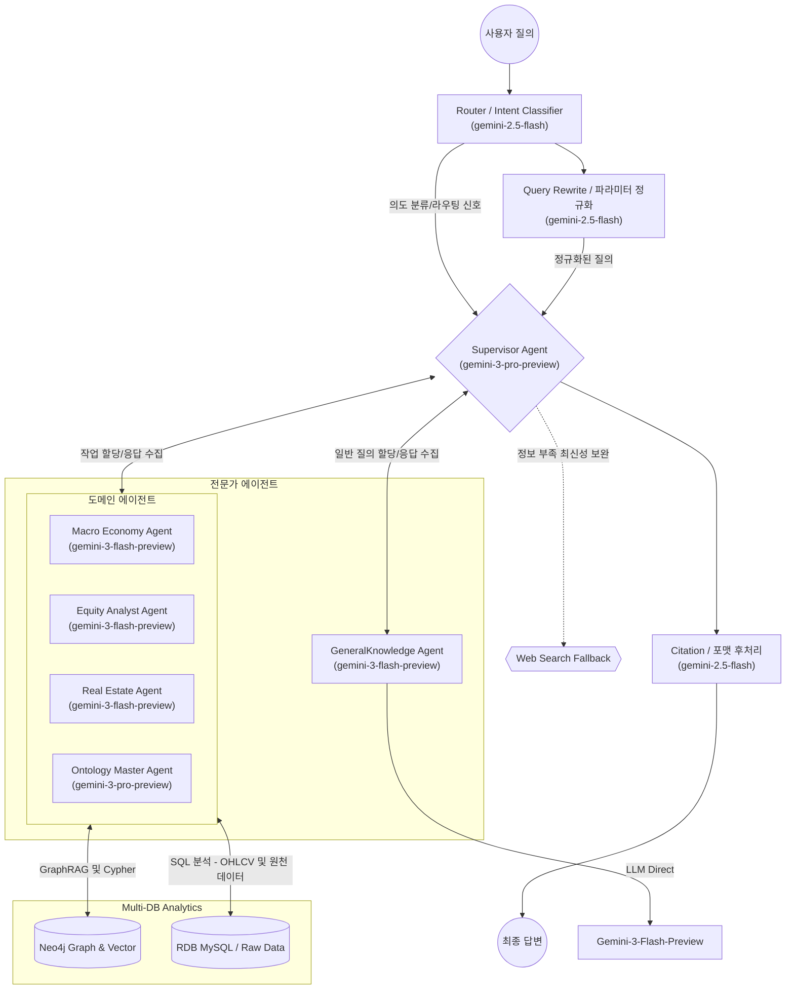

# Neo4j 기반 Ontology Macro Graph Multi-Agent 챗봇 기획안 (plan.md)

## 1. 개요 및 목표
* **목표:** 수집된 거시/주식/부동산 데이터를 바탕으로, 근거 기반·시점 정합·저지연을 동시에 만족하는 Multi-Agent 응답 시스템을 구축한다.
* **코어 기술:**
  * **Neo4j Ontology Macro Graph:** 그래프 탐색 + 벡터 검색 하이브리드.
  * **LangGraph(또는 동급 프레임워크):** Supervisor 라우팅, 병렬 에이전트 실행, 종합 응답.
* **운영 원칙:**
  * 모든 응답은 `as_of_date`(기준 시점)와 근거를 포함한다.
  * 정형 수치 질의는 우선 Cypher, 비정형 설명 질의는 우선 GraphRAG를 사용한다.
  * Tool 실패 시 디그레이드 모드로 즉시 전환하고 실패 원인을 표기한다.

## 2. Multi-Agent 아키텍처 (LangGraph 기반)
기본 실행정책은 **조건부 병렬(Conditional Parallel)** 이다.

### 2.1 라우팅 규칙 (명시적)
1. `macro intent`(금리/물가/고용/환율) -> `Macro Agent`.
2. `equity intent`(종목/실적/공시/OHLCV) -> `Equity Agent`.
3. `real estate intent`(실거래/전세가율/미분양/인허가) -> `RealEstate Agent`.
4. 복합 질의(예: 금리+부동산, 매크로+주식) -> 다중 에이전트 병렬 호출 후 Supervisor 종합.
5. 지표 간 관계/그래프 경로 질의 -> `Ontology Agent`를 항상 병행 호출.

### 2.2 RDB 융합 및 Fallback 규칙 (중복 방지)
* 기존 “에이전트 개별 웹검색 트리거” 대신, **Supervisor 단일 오케스트레이션**으로 통합한다.
* 하위 에이전트는 `needs_web_fallback=true/false` 신호만 반환한다.
* Supervisor가 최대 `N=1` 웹검색 예산으로 실행 후 모든 에이전트 결과에 공유한다.
* **Dual-Use RDB 전략 (주요 변경점):** RDB는 단순 지연 Fallback 용도가 아니다. OHLCV 같은 대용량 시계열, 정밀 실거래가 등 GraphDB에 전체를 투영하기 무거운 Raw 데이터 분석은 RDB 쿼리(Text2SQL)와 Graph 쿼리(Text2Cypher/Vector)를 조합해 사용한다.
* **기본 실행정책: 조건부 병렬(Conditional Parallel)**
  * 질의가 `정형 시계열 수치`와 `그래프 관계/근거`를 동시에 요구하면 SQLQA + CypherQA/GraphRAG를 병렬 실행한다.
  * 질의가 한쪽 도구만으로 충분하면 단일 도구 우선 실행 후, 근거 부족 시 보조 도구를 1회 추가 호출한다.
* **조건부 병렬 판정 기준(명시)**
  * `SQL 필요=true` AND `Graph 필요=true`면 병렬 실행.
  * `SQL 필요=true` AND `Graph 필요=false`면 SQL 단일 실행.
  * `SQL 필요=false` AND `Graph 필요=true`면 Graph 단일 실행.
  * `SQL 필요=false` AND `Graph 필요=false`면 `GeneralKnowledge Agent`의 `LLM Direct` 단일 실행.
* **SQL 필요=true 조건**
  * 질문이 OHLCV/수익률/변동률/거래량/기간 비교처럼 원천 시계열 수치를 직접 요구.
  * 질문이 종목·지표의 특정 기간 계산(예: 20일 수익률, 고점 대비 하락률)을 요구.
* **Graph 필요=true 조건**
  * 질문이 뉴스/이벤트/테마/인과 경로(이벤트 -> 테마 -> 지표) 설명을 요구.
  * 질문이 근거 문서 citation 기반 설명(왜 올랐는지, 어떤 리스크인지)을 요구.
* **판정 예시**
  * "팔란티어 2월 이후 하락 원인과 수급/가격 흐름" -> 병렬(SQL+Graph)
  * "KR_TOP50 오늘 거래대금 상위 10개" -> SQL 단일
  * "이번 주 금리 이슈가 기술주에 준 영향 경로" -> Graph 단일

### 2.3 에이전트 역할
1. **Supervisor Agent**
   * 인텐트 분류, 에이전트 선택/병렬 실행, 충돌 근거 정합성 판정, 최종 답변 구성.
2. **Macro Economy Agent**
   * FRED/KOSIS/ECOS 기반 거시 해석.
3. **Equity Analyst Agent**
   * KR/US Top50 실적, 공시, 뉴스, OHLCV 기반 분석.
4. **Real Estate Agent**
   * 한국 실거래/지수/정책 연계 분석.
5. **Ontology Master Agent**
   * Text2Cypher, 그래프 경로/관계 조회, 정형 수치 응답 보강.
6. **GeneralKnowledge Agent**
   * 날씨/일반상식 같은 비금융 일반 질의를 내부 DB/Neo4j 조회 없이 `gemini-3-flash-preview`로 직접 응답.

### 2.4 LangGraph State 계약 (공유 메모리)
Supervisor-하위 에이전트 간 공유 상태를 `TypedDict` 또는 `Pydantic`으로 명시한다.
* `question`, `intent`, `target_domains[]`, `requested_as_of_date`
* `max_stale_hours` (도메인별 freshness 허용치)
* `fallback_queries[]` (도구 fallback 후보 질의)
* `agent_responses{agent_name: response}` (에이전트 원본 응답)
* `data_freshness{domain: healthy|stale|missing}`
* `needs_web_fallback`, `needs_rdb_fallback`
* `final_as_of_date`, `as_of_validation_passed`, `citations[]`, `structured_citations[]`

### 2.5 에이전트별 LLM 정책 (확정)
1. `gemini-3-pro-preview` (고급 추론)
   * `Supervisor Agent`
   * `Ontology Master Agent`
2. `gemini-3-flash-preview` (중급 추론 + 속도)
   * `Macro Economy Agent`
   * `Equity Analyst Agent`
   * `Real Estate Agent`
   * `GeneralKnowledge Agent`
3. `gemini-2.5-flash` (하급 추론 + 최고속 경량 유틸)
   * `Router / Intent Classifier`
   * `Query Rewrite / 파라미터 정규화`
   * `Citation / 포맷 후처리`

## 3. 성능·안전 설계
### A. Hybrid GraphRAG
* `document_text_embedding_idx` + Graph Traversal 결합.
* Vector Top-K 검색 후 관련 엔티티 확장 조회.

### B. Text2Cypher (Schema-aware)
* 실행 전 스키마 조회(라벨/관계/속성) 후 쿼리 생성.
* 정형 수치 질의는 Cypher 우선, 설명형 질의는 GraphRAG 우선.
* 스키마 프롬프트에 **관계 방향이 포함된 스키마 문자열**을 고정 주입한다.  
  예: `(Company)-[:HAS_DAILY_BAR]->(EquityDailyBar)`.
* 방향성 혼동 방지를 위해 **Few-shot(정답/오답) 예제**를 Text2Cypher 시스템 프롬프트에 포함한다.
* 실행 결과 empty 시, 조건 미충족과 방향성 오류를 구분하기 위해 템플릿 기반 재검증 쿼리를 1회 수행한다.

### C. Context Caching / Pre-fetch
* `KR_TOP50_UNIVERSE_SNAPSHOT`, `US_TOP50_UNIVERSE_SNAPSHOT`, 핵심 메타는 캐시.
* 반복 질의는 파라미터화 쿼리 + 결과 캐시로 p95 지연 최적화.

### D. Cypher 안전장치 (필수)
1. `READ ONLY` 세션 사용.
2. 금지 키워드 차단: `CREATE`, `MERGE`, `SET`, `DELETE`, `REMOVE`, `DROP`, `CALL dbms`, `LOAD CSV`.
3. 쿼리 타임아웃(예: 3~5초) 및 결과 row 제한(예: 200).
4. `LIMIT` 강제 주입(미포함 시 자동 추가).
5. 실패 시 안전 템플릿 쿼리로 축소 재시도.

### E. 시점 정합 / 최신성 정책
1. 모든 에이전트 출력에 `as_of_date`를 포함한다.
2. source별 freshness threshold를 관리한다.  
   macro: daily/monthly 규칙, corporate: 장마감 기준, graph/news: hourly 기준.
3. stale 데이터는 결론 문구에서 강한 단정 금지 + “최신성 경고” 포함.

### F. 장애/디그레이드 전략
1. Neo4j 장애: 캐시/최근 리포트 기반 요약 모드.
2. Vector index 장애: Cypher+메타 검색만 수행.
3. Web 검색 장애: 내부 근거만으로 제한 응답, 부족 근거 명시.

## 4. Top50 연속성 정책 (월 교체 대응)
1. Universe snapshot을 월별 버전으로 저장하고, 모든 OHLCV/실적 분석은 `as_of_universe_date`를 명시한다.
2. 과거 성과 비교는 “당시 Universe” 기준과 “현재 Universe” 기준을 분리 제공한다.
3. 종목 교체 영향(편입/편출)은 리포트에 별도 라인으로 표기한다.

## 5. 로드맵 (실행 단계)
* **Step 0: Baseline/관측 체계**
  * 현재 단일 에이전트 성능 측정(정확도, 근거율, p95 latency, fallback 비율).
* **Step 1: Ontology/Schema 강화**
  * Indicator-Country-Domain 관계 표준화, 질의 템플릿 정의.
* **Step 2: Tool 계층 구현**
  * `VectorQA Tool`, `CypherQA Tool`, `SQLQA Tool(RDB용)`, Cypher Guardrail 미들웨어 구현.
* **Step 3: Multi-Agent 오케스트레이션**
  * Supervisor 라우팅 정책 + 병렬 실행 + 단일 fallback 오케스트레이터 구현.
* **Step 4: 평가/튜닝**
  * Golden set 평가, 실패 케이스 리포트 자동 생성, 프롬프트/룰 튜닝.
* **Step 5: 점진 배포**
  * Canary -> 50% -> 100% 순차 확장, 회귀 감시.

## 6. 정량 KPI / 완료 기준
| 항목 | 목표 |
| --- | --- |
| 근거 포함 응답률 | 95% 이상 |
| Schema 미스매치 없는 Cypher 실행률 | 99% 이상 |
| 관계 방향성 오류로 인한 Empty 응답률 | 1% 이하 |
| 금지 Cypher 차단율 | 100% |
| 라우팅 정확도(Golden set) | 90% 이상 |
| p95 응답 지연(단일 도메인) | 6초 이하 |
| p95 응답 지연(복합 도메인) | 10초 이하 |
| stale 데이터 단정 응답률 | 0% (항상 경고 표기) |
| fallback 평균 호출 수 | 턴당 1회 이하 |

## 7. 즉시 실행 항목 (이번 스프린트)
1. Cypher Guardrail 미들웨어 우선 적용.
2. `as_of_date`/freshness 정책을 응답 스키마에 강제 추가.
3. Supervisor 라우팅 규칙을 룰 기반으로 먼저 고정 후, LLM 보조로 확장.
4. 실패 케이스 리포트 자동 저장(원인, 쿼리, 근거, 재현 입력) 파이프라인 연결.

## 8. 수집 데이터(61개) Multi-Agent 활용 설계
`docs-main-engine/collected-data-list.md`를 기준으로, 카테고리별 책임 에이전트와 질의 처리 방식을 명시한다.

### 8.1 카테고리별 에이전트 매핑
| 데이터 카테고리 | 대표 코드 | 1차 담당 | 2차 협업 | 기본 Tool 전략 |
| --- | --- | --- | --- | --- |
| 한국 경제 | `KR_BASE_RATE`, `KR_CPI`, `KR_UNEMPLOYMENT`, `KR_USDKRW` | Macro Agent | Ontology Agent | Neo4j Cypher(수치 비교) -> GraphRAG(설명 보강) |
| 미국 경제 | `FEDFUNDS`, `CPIAUCSL`, `UNRATE`, `DGS10`, `VIXCLS` 등 | Macro Agent | Ontology Agent | Neo4j Cypher 우선 (시계열/스프레드/변화율) |
| 한국 주식 | `KR_TOP50_DAILY_OHLCV`, `KR_DART_*`, `KR_TOP50_*` | Equity Agent | Ontology Agent, Macro Agent | **RDB SQL(가격/실적 Raw 시계열)** + Neo4j GraphRAG(뉴스/공시 맥락) |
| 미국 주식 | `US_TOP50_DAILY_OHLCV`, `US_TOP50_FINANCIALS`, `US_TOP50_EARNINGS_*` | Equity Agent | Ontology Agent, Macro Agent | **RDB SQL(실적/가격 Raw 시계열)** + Neo4j GraphRAG(뉴스/테마) |
| 한국 부동산 | `KR_HOUSE_PRICE_INDEX`, `KR_REAL_ESTATE_*`, `KR_UNSOLD_HOUSING` | RealEstate Agent | Macro Agent, Ontology Agent | **RDB SQL(원천 실거래가)** + Neo4j Cypher(월별 집계) + GraphRAG(정책) |
| 공통/글로벌 | `ECONOMIC_NEWS_STREAM`, `TIER1_CORPORATE_EVENT_FEED`, `GRAPH_*` | Ontology Agent | 전 에이전트 | GraphRAG 우선 + 필요 시 Cypher |

### 8.2 Supervisor 실제 라우팅 정책 (데이터 기준)
1. 질문 내 ticker/종목/실적/가이던스 언급 -> Equity Agent 필수 호출.
2. 질문 내 금리/물가/고용/환율/리스크프리미엄 언급 -> Macro Agent 필수 호출.
3. 질문 내 지역(시군구)/실거래/전세/미분양/인허가 언급 -> RealEstate Agent 필수 호출.
4. 질문이 원인-영향 체인(이벤트 -> 테마 -> 지표)을 요구하면 Ontology Agent 병행 호출.
5. 복합 질의는 병렬 호출 후 Supervisor가 `as_of_date` 기준으로 답변 정합성 검증.

### 8.3 응답 계약(Response Contract)
모든 에이전트는 아래 공통 필드를 반환한다.
* `as_of_date`
* `data_freshness`(healthy/stale/missing)
* `key_points[]` (정량 근거 포함)
* `citations[]` (문서 근거 전용: doc_id/doc_url/evidence_id)
* `structured_citations[]` (정형 근거 전용: dataset_code/table/filters/date_range/as_of_date/query_fingerprint/row_count)
* `uncertainty` (근거 부족/시점 불일치)

### 8.4 에이전트 내부의 Tool 선택 및 병렬 실행 정책 (LLM 튜닝 방향)
LLM이 RDB와 Neo4j 중 어느 것을 호출할지 헷갈리는 문제를 막기 위해, 다음 세 가지를 프롬프트 설계에 강제한다.
1. **명확한 Tool Description 작성**:
   * `SQLQA Tool`: "시계열 수치(가격, 거래량, 실적, 지수한도 등) 원천 데이터 검색 전용"
   * `CypherQA Tool`: "테마, 뉴스 팩트, 기업 간 지배구조/관계, 거시 정책 연관성 검색 전용"
2. **Few-shot Prompting 고정 주입**: 에이전트 시스템 프롬프트에 *[Q: "팔란티어 주가 전망 어때?" -> Thought: 주가 추이는 SQL, 최신 전망/호재는 GraphRAG로 동시 조회해야 한다. Action: SQLQA & CypherQA]* 같은 예시를 주입한다.
3. **조건부 병렬 도구 호출(Conditional Parallel Tool Calling) 기본화**:
   * 기본값은 조건부 병렬이다.
   * `parallel_tool_calls=True`는 "양쪽 도구 모두가 필요"로 분류된 턴에서만 활성화한다.
   * 단일 도메인/단일 근거로 충분한 질의는 직렬 단일 호출로 비용/복잡도를 줄인다.
4. **SQL 근거와 문서 근거의 분리 반환**:
   * SQL/정형 결과는 `structured_citations[]`로만 반환한다.
   * 문서/뉴스 근거는 `citations[]`로만 반환한다.

## 9. Neo4j 수집/동기화 전략 (검토 결과)
### 9.1 결론: 원천은 RDB, 질의 최적화용 그래프 투영(Projection) 병행
권장 전략은 **Raw Full Data는 MySQL 유지**, **그래프 질의에 필요한 핵심 구조만 Neo4j에 투영**하는 하이브리드 방식이다.
* 장점:
  * 대용량 시계열(OHLCV, 실거래 원천) 재적재 비용 절감
  * 그래프 추론(연관성, 이벤트 영향, 근거 연결) 성능 확보
  * 장애 시 RDB fallback 경로 유지

### 9.2 도메인별 Neo4j 적재 원칙
1. 한국/미국 경제 지표
   * 현재 구현 활용: `IndicatorLoader` (`fred_data` -> `EconomicIndicator`-`IndicatorObservation`).
   * 유지 필드: `obs_date`, `value`, `effective_date`, `published_at`, `as_of_date`, `revision_flag`.
2. 뉴스/문서/근거 그래프
   * 현재 구현 활용: `NewsLoader`, `DocumentEmbeddingLoader`.
   * 핵심 라벨: `Document`, `Event`, `Fact`, `Claim`, `Evidence`, `Entity`, `EntityAlias`.
   * 핵심 관계: `ABOUT_THEME`, `AFFECTS`, `SUPPORTS`, `MENTIONS`, `CAUSES`.
3. 한국 부동산
   * 현재 구현 활용: `RealEstateSummaryLoader` (`kr_real_estate_monthly_summary` -> `RealEstateMonthlySummary`).
   * 원천 거래 row(`KR_REAL_ESTATE_TRANSACTIONS`)는 RDB 유지, 월간 질의용 summary만 그래프 투영.
4. 한국/미국 주식 (신규 그래프 투영 필요)
   * 제안 라벨:
     * `Company`(security_id, country_code, native_code, symbol, corp_code/cik)
     * `EquityUniverseSnapshot`(country_code, market, snapshot_date, rank)
     * `EquityDailyBar`(security_id, trade_date, ohlcv)
     * `EarningsEvent`(event_key, security_id, period, expected/confirmed, source)
   * 식별자 표준:
     * `security_id = "{country_code}:{native_code}"`
     * KR: `native_code=6자리 종목코드` (예: `KR:005930`)
     * US: `native_code=티커 심볼` (예: `US:AAPL`)
   * 제안 관계:
     * `(Company)-[:IN_UNIVERSE {snapshot_date, rank}]->(EquityUniverseSnapshot)`
     * `(Company)-[:HAS_DAILY_BAR]->(EquityDailyBar)`
     * `(Company)-[:HAS_EARNINGS_EVENT]->(EarningsEvent)`
     * `(EarningsEvent)-[:SUPPORTED_BY]->(Evidence|Document)`

### 9.3 Neo4j 스키마/인덱스 권장안
1. 고유키 제약
   * `EconomicIndicator(indicator_code)`
   * `IndicatorObservation(indicator_code, obs_date)`
   * `Document(doc_id)`, `Event(event_id)`, `Evidence(evidence_id)`
   * `RealEstateMonthlySummary(summary_key)`
   * (신규) `Company(security_id)`, `EquityDailyBar(security_id, trade_date)`, `EarningsEvent(event_key)`
2. 조회 인덱스
   * `Company(security_id)` (PK 탐색)
   * `Company(country_code, native_code)` (보조 탐색)
   * `Company(symbol)`, `Company(corp_code)`, `Company(cik)`
   * `EquityDailyBar(security_id)`, `EquityDailyBar(trade_date)`, `EarningsEvent(event_date)`, `EquityUniverseSnapshot(snapshot_date)`
3. 벡터 인덱스
   * `document_text_embedding_idx` 유지, 상태 모니터링은 `GRAPH_RAG_VECTOR_INDEX_READY`로 통합 관리.

### 9.4 수집/동기화 배치 순서 권장
1. RDB 수집 완료 시 `COLLECTION_COMPLETED` 이벤트 발행 (`source`, `domain`, `as_of_date`, `row_count`)
2. 이벤트 트리거로 Neo4j Projection Orchestrator 즉시 실행
3. 엔티티/유니버스 투영 (`Company`, `EquityUniverseSnapshot`)
4. 시계열 투영 (`IndicatorObservation`, `EquityDailyBar`, `RealEstateMonthlySummary`)
5. 이벤트/근거 투영 (`EarningsEvent`, `corporate_event_feed`, `Document/Event/Fact/Claim/Evidence`)
6. 임베딩 및 GraphRAG 품질 배치
7. 안전장치: 일 1회 스케줄 백필 배치로 누락 이벤트 재처리

### 9.5 운영 체크포인트
1. 배치마다 `rows_fetched`, `upserted`, `failed`, `latest_as_of`를 health 지표와 함께 기록.
2. `stale` 또는 `missing`이면 해당 도메인 에이전트가 강한 결론을 내리지 않도록 응답 정책 강제.
3. 월별 Top50 교체 시, `snapshot_date` 기준 질의와 현재 기준 질의를 분리 제공.
4. `RDB -> Neo4j projection_lag_minutes`를 측정하고 임계치 초과 시 경고/자동 재시도.
5. 시차 발생 시 조회 우선순위는 `Neo4j -> RDB fallback -> (필요 시) Web Search`로 강제.

## 10. Neo4j 확장 구현 태스크 (추가)
1. `EquityGraphLoader` 신규 구현  
   * 입력: `KR_TOP50_*`, `US_TOP50_*`, `KR_DART_*`, `US_TOP50_EARNINGS_*`
   * 출력: `Company`, `EquityUniverseSnapshot`, `EquityDailyBar`, `EarningsEvent` 그래프 투영
2. `corporate_event_feed` -> Neo4j 브릿지 로더 구현  
   * 이벤트를 `Event/EarningsEvent`와 연결하고 근거 `Document/Evidence`를 참조
3. Supervisor 라우팅에서 카테고리 코드셋을 직접 참조하는 룰셋 파일화  
   * 데이터 추가 시 라우팅 정책 자동 반영
4. Text2Cypher 프롬프트 템플릿 고도화  
   * 방향 포함 스키마 문자열 + 방향성 Few-shot 예제 + empty 재검증 템플릿 적용
5. LangGraph 공통 State 모델 구현  
   * `fallback_queries`, `agent_responses`, `max_stale_hours`, `as_of_validation` 포함
6. Projection 오케스트레이터 이벤트 연동  
   * RDB 수집 완료 이벤트 수신 시 Neo4j Projection 파이프라인 즉시 실행
7. Citation 스키마 분리 구현
   * API 응답/저장 스키마에 `citations[]`(문서)와 `structured_citations[]`(SQL)를 분리하고, 회귀 테스트 최소 검증 항목에 포함

## 11. 확정된 의사결정 (2026-02-20)
1. SQL 근거는 `citations`와 분리해서 `structured_citations`로 관리한다.
   * `citations`: 문서/뉴스/이벤트 근거(`doc_id`, `doc_url`, `evidence_id`)
   * `structured_citations`: 정형 조회 근거(`dataset_code`, `table`, `filters`, `date_range`, `as_of_date`, `query_fingerprint`, `row_count`)
2. 식별자는 `security_id`를 정규키로 통합한다.
   * 표준: `security_id = "{country_code}:{native_code}"`
   * 예시: `KR:005930`, `US:AAPL`
3. 기본 실행정책은 "조건부 병렬"로 고정한다.
   * 양쪽 도구가 모두 필요한 질의만 병렬 호출
   * 단일 도구로 충분한 질의는 단일 호출 우선 후 필요 시 보조 호출

## 12. 작업 세부 계획: 에이전트별 RDB/Neo4j 조회 전략
### 12.1 에이전트별 데이터 소스 매핑
| 에이전트 | RDB 1순위 조회 대상 | Neo4j 1순위 조회 대상 | 기본 실행 모드 | structured_citations 대상 |
| --- | --- | --- | --- | --- |
| Supervisor Agent | `macro_collection_run_reports`, `corporate_tier_state`(freshness/active 확인), 요청별 하위 에이전트 결과 캐시 | `GraphRagApiCall`, `AnalysisRun` | 단일(오케스트레이션) | 최종 병합 결과만 집계 |
| Macro Economy Agent | `fred_data`, `economic_news` | `EconomicIndicator`, `IndicatorObservation`, `DerivedFeature`, `Event`, `Document`, `Evidence`, `MacroTheme` + `AFFECTS/ABOUT_THEME/HAS_OBSERVATION` | 조건부 병렬 | `fred_data` 기반 수치 질의 |
| Equity Analyst Agent | `kr_top50_daily_ohlcv`, `us_top50_daily_ohlcv`, `kr_corporate_financials`, `us_corporate_financials`, `kr_corporate_disclosures`, `us_corporate_earnings_events`, `corporate_event_feed`, `kr/us_top50_universe_snapshot`, `corporate_entity_registry` | (현재) `Document`, `Event`, `Claim`, `Evidence`, `MacroTheme`; (확장) `Company`, `EquityDailyBar`, `EarningsEvent`, `EquityUniverseSnapshot` + `HAS_DAILY_BAR/HAS_EARNINGS_EVENT/IN_UNIVERSE` | 조건부 병렬 | OHLCV/실적/유니버스 SQL |
| Real Estate Agent | `kr_real_estate_transactions`, `kr_real_estate_monthly_summary`, (연계) `fred_data` | `RealEstateMonthlySummary`, `EconomicIndicator`, `IndicatorObservation`, `Document`, `Event`, `Evidence` | 조건부 병렬 | 실거래 원천/월간 요약 SQL |
| Ontology Master Agent | (보조) projection lag 확인용 운영 테이블 | `Document`, `Event`, `Fact`, `Claim`, `Evidence`, `MacroTheme`, `EconomicIndicator`, `Story` + `ABOUT_THEME/AFFECTS/SUPPORTS/CONTAINS` | Neo4j 단일 우선 | 기본 없음(필요 시만) |

### 12.2 에이전트별 실행 전략 (질의 유형 기준)
1. Supervisor Agent
   * 입력 질의를 `intent/domain/sql_need/graph_need`로 분해.
   * `sql_need && graph_need`일 때만 하위 에이전트 병렬 호출.
   * `as_of_date`와 freshness를 교차 검증 후, 최종 응답에 `citations`와 `structured_citations`를 분리 병합.

2. Macro Economy Agent
   * 수치 중심 질의(금리/스프레드/최근 n개월 변화율): Neo4j Cypher 우선, 누락 시 `fred_data` SQL fallback.
   * 설명 중심 질의(왜 올랐나/영향 경로): Neo4j GraphRAG 우선.
   * 수치+설명 결합 질의: SQL(검산) + GraphRAG(인과 설명) 병렬.

3. Equity Analyst Agent
   * 가격/변동률/기간 수익률/거래량: RDB SQL(OHLCV) 우선.
   * 실적/가이던스/공시 해석: RDB SQL(실적·공시) + Neo4j 근거 문서 병행.
   * 전망/원인 질의: SQL 추세 + GraphRAG 이벤트/테마를 조건부 병렬로 결합.
   * 식별자 해석은 항상 `security_id`로 정규화 후 조회(`KR:stock_code`, `US:symbol`).

4. Real Estate Agent
   * 상세 거래(지역·기간·면적·가격): `kr_real_estate_transactions` SQL 우선.
   * 월간 트렌드/지역 비교: `kr_real_estate_monthly_summary` SQL + Neo4j `RealEstateMonthlySummary` 교차검증.
   * 금리/거시 연계 설명: Neo4j `EconomicIndicator`/`Event` 경로 결합.

5. Ontology Master Agent
   * Text2Cypher로 경로/관계 질의 처리, 방향성 강제 프롬프트 적용.
   * Empty 결과 시 스키마/방향 재검증 1회, 이후 Supervisor에 fallback 신호 전달.
   * 정형 수치 자체는 생성하지 않고, 관계 근거 보강 역할에 집중.

### 12.3 구현 순서(실행 태스크)
1. 라우팅 레이어
   * `sql_need`, `graph_need`, `target_agent[]` 산출기를 Supervisor 앞단에 구현.
   * 조건부 병렬 매트릭스를 코드 정책으로 고정.

2. 에이전트 I/O 계약
   * 공통 출력 스키마에 `citations[]`/`structured_citations[]` 분리 강제.
   * `structured_citations` 최소 필드(`dataset_code`, `table`, `filters`, `date_range`, `as_of_date`, `query_fingerprint`, `row_count`) 검증 추가.

3. Equity 식별자 정규화
   * 입력 종목 엔티티를 `security_id`로 통합 매핑.
   * KR `stock_code`/US `symbol` 혼용을 모두 `security_id`로 변환 후 SQL/Cypher 호출.

4. 도메인별 쿼리 템플릿
   * Macro/Equity/RealEstate별 SQL 템플릿 + Cypher 템플릿 세트 작성.
   * 템플릿마다 required params와 fallback 조건 정의.

5. 평가/회귀
   * Golden set에 에이전트별 “단일 실행 vs 조건부 병렬” 기대 결과 추가.
   * 회귀 리포트에 `tool_mode(single|parallel)` 및 `structured_citation_count` 추가.

### 12.4 완료 기준(세부)
1. 에이전트별 조회 실패 시에도 `왜 어떤 DB/그래프를 선택했는지` 로그로 재현 가능.
2. Equity/RealEstate 질의에서 SQL 근거가 있으면 `structured_citations`가 1건 이상 반환.
3. 수치 질의에서 문서 citation만 반환되는 케이스를 0으로 축소.
4. 복합 질의의 병렬 실행률과 단일 질의의 불필요 병렬 비율을 분리 모니터링.

## 13. Phase별 세부 실행 계획 (현황 포함)
본 섹션은 "이미 작업된 항목"과 "앞으로 구현할 항목"을 실행 단계로 고정한 운영용 계획이다.

### 13.1 현재 상태 요약 (2026-02-20 기준)
| Phase | 상태 | 현재 평가 |
| --- | --- | --- |
| Phase 0. 설계/정책 고정 | 완료 | 라우팅, fallback, Cypher 안전장치, freshness, citation 분리 정책 문서화 완료 |
| Phase 1. 라우팅 스켈레톤 | 완료 | `sql_need/graph_need/tool_mode/target_agents` 산출 로직과 단위테스트 반영 완료 |
| Phase 2. Supervisor 실행기 연결 | 완료 | `supervisor_execution` 분기 + `llm_direct`(general_knowledge) + agent별 SQL/Graph live executor(템플릿) + single 모드 companion fallback 1회 호출까지 연결 완료 |
| Phase 3. Agent I/O 계약 구현 | 완료 | `structured_citations` 응답/캐시/analysis_run metadata 경로 반영 + SQL branch 기반 자동 생성/검증 테스트 완료 |
| Phase 4. 식별자/쿼리 표준화 | 완료 | `security_id` 유틸 + 템플릿 레지스트리 분리 + `matched_security_ids` 라우팅/컨텍스트 반영 + Ontology Cypher 방향성 스키마/ few-shot 고정 주입 및 방향 검증 로직 반영 완료 |
| Phase 5. Neo4j 주식 Projection | 완료 | KR/US 월간 Universe·실적 감시·OHLCV 핫패스 전 구간에서 Graph 동기화 트리거 연결 완료 + projection lag metric/경고 정책(`EQUITY_GRAPH_PROJECTION_SYNC`)까지 반영 완료 |
| Phase 6. 회귀/운영 자동화 | 부분 진행 | 회귀 관측 필드 + `expected_tool_mode` 검증 + `expected_target_agents` 검증 + 주간 자동 집계 리포트/스케줄 + `/admin/indicators` 주간 헬스 연동 + Slack 스킵 + 운영 DB 스키마 호환/실행 검증 + Top 실패원인/케이스 자동요약 + agent 전용 단위테스트(4종) + 도메인별 single/parallel 골든셋 케이스 확장 완료, KPI 자동 리포트 항목 일부 보강 필요 |

### 13.2 완료된 작업 상세 (Done)
1. 문서 설계 고도화 완료
   * 근거: `workflow/01~07` 문서 반영 완료.
   * 핵심: 조건부 병렬 기준, 에이전트별 RDB/Neo4j 조회 전략, 동기화/lag 운영 원칙, KPI 고정.
2. Supervisor 라우팅 플래그 스켈레톤 구현 완료
   * 코드: `hobot/service/graph/rag/response_generator.py`
   * 반영: `query_route.sql_need`, `query_route.graph_need`, `query_route.tool_mode`, `query_route.target_agents`.
   * 테스트: `hobot/tests/test_phase_d_response_generator.py` 내 라우팅 플래그 3건 검증 추가.
3. 구현 로그 문서화 완료
   * `workflow/08_supervisor_routing_flags_skeleton.md`에 코드/테스트 결과 기록.
4. Phase 2 1차 착수 완료
   * 코드: `hobot/service/graph/rag/response_generator.py`
   * 반영: `supervisor_execution`(conditional_parallel 실행 트레이스) 생성 및 응답/저장 메타 연결.
   * 테스트: `hobot/tests/test_phase_d_response_generator.py` 내 실행 트레이스 검증 2건 추가.
5. Phase 2 2차 착수 완료 (stub executor 연결)
   * 코드: `hobot/service/graph/rag/agents/*`, `hobot/service/graph/rag/response_generator.py`
   * 반영: `macro/equity/real_estate/ontology` agent stub 엔트리 생성 및 `single/parallel` 분기 실행 연결.
   * 테스트: 실행 결과(`execution_result`) 검증 확장.
6. Phase 2 3차 착수 완료 (GeneralKnowledge direct LLM 경로)
   * 코드: `hobot/service/graph/rag/response_generator.py`, `hobot/service/graph/rag/agents/general_knowledge_agent.py`, `hobot/service/graph/rag/agents/__init__.py`
   * 반영: `general_knowledge` 라우팅 + `sql_need=false/graph_need=false` + `llm_direct` branch 실행 + `gemini-3-flash-preview` 강제.
   * 테스트: `hobot/tests/test_phase_d_response_generator.py`에 일반 질의 라우팅/컨텍스트 미조회 검증 2건 추가.
   * 로그: `workflow/13_general_knowledge_agent_route.md`
7. 에이전트별 LLM 정책 고정 완료
   * 코드: `hobot/service/graph/rag/response_generator.py`
   * 반영:
     * `Supervisor/Ontology -> gemini-3-pro-preview`
     * `Macro/Equity/RealEstate/GeneralKnowledge -> gemini-3-flash-preview`
     * `Router/Rewrite/Normalization/CitationPostprocess -> gemini-2.5-flash`
   * 테스트: `hobot/tests/test_phase_d_response_generator.py`에 라우터 모델 및 `agent_model_policy` 검증 추가.
8. Phase 2 4차 착수 완료 (Live Tool Probe + Companion Fallback)
   * 코드: `hobot/service/graph/rag/agents/tool_probe.py`, `hobot/service/graph/rag/agents/*.py`, `hobot/service/graph/rag/response_generator.py`
   * 반영:
     * Macro/Equity/RealEstate/Ontology agent가 branch별 SQL/Graph probe 결과를 `tool_probe`로 반환.
     * `single` 모드에서 주 브랜치가 `needs_companion_branch=true`를 반환하면 보조 브랜치를 1회 자동 호출.
     * 실행 결과에 `fallback_used`, `fallback_reason` 필드 추가.
   * 테스트: `hobot/tests/test_phase_d_response_generator.py`에 companion fallback 단위 테스트 1건 추가.
9. Phase 2 5차 착수 완료 (도메인 Live SQL/Cypher 템플릿 실행기 연결)
   * 코드:
     * `hobot/service/graph/rag/agents/live_executor.py` (신규)
     * `hobot/service/graph/rag/agents/macro_agent.py`
     * `hobot/service/graph/rag/agents/equity_agent.py`
     * `hobot/service/graph/rag/agents/real_estate_agent.py`
     * `hobot/service/graph/rag/agents/ontology_agent.py`
   * 반영:
     * agent별 SQL 템플릿(테이블/컬럼 자동 탐지 기반) 실행 + Graph 템플릿(Cypher) 실행 경로 연결.
     * DB/Neo4j 일시 장애 시 fast-fail window 기반 `degraded` 반환으로 companion fallback과 자연스럽게 연동.
     * 기존 `tool_probe` 계약(`tool`, `status`, `reason`, `duration_ms`) 유지.
   * 테스트:
     * `hobot/tests/test_phase_d_response_generator.py` 통과 (sandbox)
     * `GRAPH_RAG_REQUIRE_DB_TESTS=1` 강제 모드 통과 (tunnel DB 환경)
10. Phase 3 완료 (Agent I/O 계약 및 Citation 이중화 반영)
   * 코드:
     * `hobot/service/graph/rag/response_generator.py`
   * 반영:
     * 응답 스키마에 `structured_citations[]` 정식 필드 연결.
     * `supervisor_execution` SQL branch(`tool_probe`)에서 정형 근거를 자동 생성해 `structured_citations`로 병합.
     * `analysis_run` 저장 메타/캐시 복원 경로에 `structured_citations` 포함.
   * 테스트:
     * `hobot/tests/test_phase_d_response_generator.py`에 structured citation 생성/응답 포함 검증 추가.
     * `GRAPH_RAG_REQUIRE_DB_TESTS=1` 강제 모드 통과.
11. Phase 4 1차 착수 완료 (`security_id` 정규화 + Equity SQL 적용)
   * 코드:
     * `hobot/service/graph/rag/security_id.py` (신규)
     * `hobot/service/graph/rag/agents/live_executor.py`
   * 반영:
     * `security_id = "{country_code}:{native_code}"` 정규화 유틸 구현.
     * Equity SQL 템플릿에서 `security_id` 컬럼이 존재하면 `symbol`보다 우선 필터하도록 실행기 표준화.
   * 테스트:
     * `hobot/tests/test_phase4_security_id.py` (신규) 추가 및 통과.
12. Phase 4 2차 착수 완료 (도메인 템플릿 레지스트리 분리 + matched_security_ids 라우팅)
   * 코드:
     * `hobot/service/graph/rag/templates/__init__.py` (신규)
     * `hobot/service/graph/rag/templates/macro_query_templates.py` (신규)
     * `hobot/service/graph/rag/templates/equity_query_templates.py` (신규)
     * `hobot/service/graph/rag/templates/real_estate_query_templates.py` (신규)
     * `hobot/service/graph/rag/templates/ontology_query_templates.py` (신규)
     * `hobot/service/graph/rag/agents/live_executor.py`
     * `hobot/service/graph/rag/response_generator.py`
   * 반영:
     * `live_executor` 하드코딩 템플릿을 도메인별 `templates/*` 레지스트리로 분리.
     * 라우팅 결과에 `matched_security_ids`를 추가하고, `to_context_request`에서 `matched_symbols`가 없을 때 `matched_security_ids`를 심볼로 복원해 focus에 반영.
     * US single stock 강제 라우팅 시 `US:{ticker}` 형태 security_id 동시 기록.
   * 테스트:
     * `hobot/tests/test_phase_d_response_generator.py` 라우팅/컨텍스트 fallback 테스트 보강 및 통과.
     * `GRAPH_RAG_REQUIRE_DB_TESTS=1` 강제 모드 통과.
13. Phase 4 3차 착수 완료 (Ontology Cypher 방향성 스키마/프롬프트 계약 고정)
   * 코드:
     * `hobot/service/graph/rag/templates/cypher_schema_prompt.py` (신규)
     * `hobot/service/graph/rag/agents/ontology_agent.py`
   * 반영:
     * 방향 포함 스키마 문자열 + direction few-shot 고정 프롬프트 계약(`prompt_version`) 구현.
     * 생성 Cypher 역방향 패턴 검증(`validate_cypher_direction`) 결과를 `tool_probe`에 포함.
   * 테스트:
     * `hobot/tests/test_phase4_ontology_cypher_prompt.py` (신규) 추가 및 통과.
     * `hobot/tests/test_phase_d_response_generator.py` + `GRAPH_RAG_REQUIRE_DB_TESTS=1` 강제 모드 통과.
14. Phase 5 1차 착수 완료 (주식 Projection 로더 + 이벤트 기반 동기화 트리거)
   * 코드:
     * `hobot/service/graph/equity_loader.py` (신규)
     * `hobot/service/macro_trading/scheduler.py`
     * `hobot/service/graph/__init__.py`
   * 반영:
     * RDB(`kr/us_top50_universe_snapshot`, `kr/us_top50_daily_ohlcv`, `kr/us earnings`) -> Neo4j(`Company`, `EquityUniverseSnapshot`, `EquityDailyBar`, `EarningsEvent`) 투영 로더 구현.
     * 관계 방향 `Company-[:IN_UNIVERSE]->Snapshot`, `Company-[:HAS_DAILY_BAR]->Bar`, `Company-[:HAS_EARNINGS_EVENT]->Event` 고정.
     * KR/US OHLCV 핫패스 완료 직후 `sync_equity_projection_to_graph` 자동 호출(환경변수 on/off 포함) 연결.
   * 테스트:
     * `hobot/tests/test_phase5_equity_projection.py` (신규) 통과.
     * `hobot/service/macro_trading/tests/test_scheduler_kr_top50_ohlcv.py` 통과.
     * `hobot/service/macro_trading/tests/test_scheduler_us_top50_ohlcv.py` 통과.
15. Phase 5 2차 착수 완료 (월간/실적 트리거 확장 + projection lag 경고 자동화)
   * 코드:
     * `hobot/service/macro_trading/scheduler.py`
     * `hobot/service/macro_trading/indicator_health.py`
   * 반영:
     * KR/US `run_*_top50_monthly_snapshot_job` 완료 직후 `sync_equity_projection_to_graph` 트리거 연결.
     * KR/US `run_*_top50_earnings_hotpath` 완료 직후 `sync_equity_projection_to_graph` 트리거 연결.
     * `sync_equity_projection_to_graph`에 projection lag metric(`lag_hours`, `latest_graph_date`) 계산 + 경고 정책(`warn/fail lag threshold`) + run report(`EQUITY_GRAPH_PROJECTION_SYNC`) 기록 추가.
     * `/admin/indicators` 헬스 지표에 `EQUITY_GRAPH_PROJECTION_SYNC` 코드, 실행 상태/lag 노트 표시 연동.
   * 테스트:
     * `hobot/service/macro_trading/tests/test_scheduler_kr_top50_snapshot.py` 통과.
     * `hobot/service/macro_trading/tests/test_scheduler_us_top50_snapshot.py` 통과.
     * `hobot/service/macro_trading/tests/test_scheduler_kr_top50_earnings.py` 통과.
     * `hobot/service/macro_trading/tests/test_scheduler_us_top50_earnings.py` 통과.
   * `hobot/service/macro_trading/tests/test_scheduler_equity_projection_sync.py` (신규) 통과.
   * `hobot/service/macro_trading/tests/test_indicator_health.py` 통과.
16. Phase 6 1차 착수 완료 (회귀/운영 관측 필드 확장)
   * 코드:
     * `hobot/service/graph/monitoring/phase5_regression.py`
     * `hobot/service/macro_trading/scheduler.py`
   * 반영:
     * 케이스 단위 회귀 결과에 `tool_mode`, `target_agents`, `structured_citation_count`, `freshness_status`를 표준 필드로 저장.
     * 회귀 집계 리포트에 `tool_mode_counts`, `target_agent_counts`, `freshness_status_counts`, `structured_citation_stats` 추가.
     * `GRAPH_RAG_PHASE5_REGRESSION` run report details와 실패 debug entries에 위 관측 필드 연동.
   * 테스트:
     * `hobot/tests/test_phase5_golden_regression.py` 통과.
     * `hobot/service/macro_trading/tests/test_scheduler_graph_phase5_regression.py` 통과.
     * `hobot/tests/test_phase5_regression_batch_runner.py` 회귀 통과.
17. Phase 6 2차 착수 완료 (single/parallel 골든셋 분리 검증)
   * 코드:
     * `hobot/service/graph/monitoring/golden_sets/phase5_q1_q6_v1.json`
     * `hobot/service/graph/monitoring/phase5_regression.py`
     * `hobot/service/macro_trading/scheduler.py`
   * 반영:
     * 골든셋 케이스에 `expected_tool_mode`(`single|parallel`) 필드 추가.
     * 회귀 평가 시 `tool_mode`와 기대값 불일치 시 `routing_mismatch` 실패 카테고리로 판정.
     * 실패 디버그 엔트리에 `expected_tool_mode` 저장.
   * 테스트:
     * `hobot/tests/test_phase5_golden_regression.py` 통과.
     * `hobot/tests/test_phase5_regression_batch_runner.py` 통과.
     * `hobot/service/macro_trading/tests/test_scheduler_graph_phase5_regression.py` 통과.
18. Phase 6 3차 착수 완료 (주간 자동 집계 리포트 + 스케줄 연결)
   * 코드:
     * `hobot/service/macro_trading/scheduler.py`
   * 반영:
     * `run_graph_rag_phase5_weekly_report(days=7)` 구현: 최근 N일 `GRAPH_RAG_PHASE5_REGRESSION` 실행 로그를 집계해 `avg_pass_rate`, `routing_mismatch_count`, `structured_citation` 통계를 계산.
     * `GRAPH_RAG_PHASE5_WEEKLY_REPORT` run report 저장 및 상태 판정(`healthy|warning`) 연동.
     * `setup_graph_rag_phase5_weekly_report_scheduler()` 구현(기본: 매주 월요일 08:20) + `start_news_scheduler_thread`/`start_all_schedulers`에 자동 등록.
     * 주간 요약 run report 집계를 별도 잡(`GRAPH_RAG_PHASE5_WEEKLY_REPORT`)으로 분리해 운영 지표화.
   * 테스트:
     * `hobot/service/macro_trading/tests/test_scheduler_graph_phase5_regression.py` 내 주간 집계/경고/스케줄 등록 테스트 통과.
19. Phase 6 4차 착수 완료 (Slack 스킵 + /admin/indicators 주간 헬스 노출)
   * 코드:
     * `hobot/service/macro_trading/scheduler.py`
     * `hobot/service/macro_trading/indicator_health.py`
     * `hobot/service/macro_trading/tests/test_indicator_health.py`
   * 반영:
     * `run_graph_rag_phase5_weekly_report`의 Slack 알림 분기 제거(운영 지시: Slack 스킵).
     * `GRAPH_RAG_PHASE5_WEEKLY_REPORT`를 indicators registry/run-health/query-map에 연결.
     * `/admin/indicators` 노트에 주간 집계 핵심값(`avg_pass_rate`, `routing_mismatch`, `avg_structured_citation`) 표시.
   * 테스트:
     * `hobot/service/macro_trading/tests/test_indicator_health.py`에 주간 리포트 노트 검증 추가.
     * `hobot/service/macro_trading/tests/test_scheduler_graph_phase5_regression.py` 회귀 유지 확인.
20. Phase 6 5차 착수 완료 (운영 DB 스키마 호환 수정 + 수동 실행 검증)
   * 코드:
     * `hobot/service/macro_trading/scheduler.py`
   * 반영:
     * 주간 집계 SQL을 `macro_collection_run_reports` 실스키마 기준으로 수정:
       * `run_success`/`details` 의존 제거
       * `run_count/success_run_count/failed_run_count/details_json/report_date` 기반 집계로 변경
     * 주간 집계 run 수를 `sum(run_count)` 기준으로 보정.
     * 운영 DB에서 `run_graph_rag_phase5_weekly_report(days=7)` 수동 실행 성공 확인.
   * 검증:
     * `get_macro_indicator_health_snapshot()`에서 `GRAPH_RAG_PHASE5_WEEKLY_REPORT` 행/노트 노출 확인.
     * 단위테스트 재통과:
       * `hobot/service/macro_trading/tests/test_scheduler_graph_phase5_regression.py`
       * `hobot/service/macro_trading/tests/test_indicator_health.py`
21. Phase 6 6차 착수 완료 (주간 실패 원인/케이스 자동요약 + 통과율 보정)
   * 코드:
     * `hobot/service/macro_trading/scheduler.py`
     * `hobot/service/macro_trading/indicator_health.py`
     * `hobot/service/macro_trading/tests/test_scheduler_graph_phase5_regression.py`
     * `hobot/service/macro_trading/tests/test_indicator_health.py`
   * 반영:
     * 주간 리포트에 `top_failure_categories`, `top_failed_cases` 자동 집계 추가.
     * `last_success_rate_pct`가 0으로 깨진 경우 `success_count/failure_count` 기반 통과율 보정 로직 추가.
     * `/admin/indicators` note에 `Top실패`, `Top케이스` 표시 추가.
   * 검증:
     * 운영 DB 실실행 결과:
       * `avg_pass_rate_pct=25.00`
       * `top_failure_categories=[freshness_stale:2]`
       * `top_failed_cases=[Q1..., Q5...]`
   * 단위테스트 재통과:
     * `hobot/service/macro_trading/tests/test_scheduler_graph_phase5_regression.py`
     * `hobot/service/macro_trading/tests/test_indicator_health.py`

22. Phase 6 7차 착수 완료 (에이전트 전용 단위테스트 보강)
   * 코드:
     * `hobot/tests/test_phase_d_macro_agent.py` (신규)
     * `hobot/tests/test_phase_d_equity_agent.py` (신규)
     * `hobot/tests/test_phase_d_real_estate_agent.py` (신규)
     * `hobot/tests/test_phase_d_ontology_agent.py` (신규)
   * 반영:
     * Macro/Equity/RealEstate/Ontology agent의 branch별 실행 상태(`executed/degraded`), primary store 판정, companion branch 요청 신호를 단위테스트로 고정.
     * Ontology agent의 direction validation/prompt contract 주입 결과를 Phase-D 관점에서도 재검증.
   * 단위테스트 재통과:
     * `hobot/tests/test_phase_d_macro_agent.py`
     * `hobot/tests/test_phase_d_equity_agent.py`
     * `hobot/tests/test_phase_d_real_estate_agent.py`
     * `hobot/tests/test_phase_d_ontology_agent.py`
     * `hobot/tests/test_phase_d_response_generator.py`

23. Phase 6 8차 착수 완료 (도메인별 골든셋 single/parallel 커버리지 확장)
   * 코드:
     * `hobot/service/graph/monitoring/phase5_regression.py`
     * `hobot/service/graph/monitoring/golden_sets/phase5_q1_q6_v1.json`
     * `hobot/tests/test_phase5_golden_regression.py`
   * 반영:
     * 골든셋 케이스 스키마에 `expected_target_agents[]` 필드 추가.
     * 회귀 평가 시 실제 `target_agents`가 기대 에이전트를 포함하지 않으면 `routing_mismatch`로 실패 처리.
     * 기본 골든셋에 Macro/Equity/RealEstate/Ontology 각각 `single`/`parallel` 케이스를 추가해 agent DoD(13.12-4) 충족을 위한 커버리지 기반을 확보.
   * 단위테스트 재통과:
     * `hobot/tests/test_phase5_golden_regression.py`
     * `hobot/tests/test_phase5_regression_batch_runner.py`
     * `hobot/service/macro_trading/tests/test_scheduler_graph_phase5_regression.py`
     * `hobot/tests/test_phase_d_response_generator.py` (`GRAPH_RAG_REQUIRE_DB_TESTS=1`)

### 13.3 Phase 2: Supervisor 실행기 연결 (완료)
목표: 라우팅 판단값을 "실제 실행 경로"로 연결한다.
진행 현황: `single/parallel` + `llm_direct(general_knowledge)` + agent별 live tool probe + single 모드 companion fallback + 도메인별 SQL/Cypher 템플릿 executor 연결까지 완료.

1. 구현 범위
   * Supervisor 실행 노드에서 `tool_mode` 분기:
     * `parallel` -> SQLQA + GraphQA 병렬 호출
     * `single` -> 우선 도구 1개 호출 후 필요 시 보조 호출 1회
   * `target_agents[]` 기반 에이전트 호출 순서/병렬 그룹 생성.
   * 실행 로그에 `selected_agent_count`, `tool_mode`, `fallback_used` 기록.
2. 산출물
   * Supervisor orchestration 코드 (LangGraph state 업데이트 포함)
   * 분기 통합 테스트 (단일/병렬/재판정 케이스)
3. 완료 기준
   * 라우팅 로그만이 아니라 실제 호출 경로가 재현 가능해야 함.
   * `sql_need && graph_need` 질의에서 두 경로 결과가 모두 응답 병합에 반영됨.

### 13.4 Phase 3: Agent I/O 계약 및 Citation 이중화 (완료)
목표: 문서 근거와 정형 근거를 코드 레벨에서 강제 분리한다.
진행 현황: `structured_citations`가 응답/캐시/저장 경로에 연결되었고, SQL branch 실행 결과에서 자동 생성되도록 반영 완료.

1. 구현 범위
   * 공통 응답 모델에 `structured_citations[]` 정식 필드 추가.
   * Agent별 adapter:
     * SQL 결과 -> `structured_citations`
     * 문서/그래프 결과 -> `citations`
   * 저장 경로(analysis_run metadata)도 동일 구조로 분리.
2. 산출물
   * Pydantic 스키마 변경
   * Response merge 유틸 변경
   * 회귀 테스트(정형 질의에서 `structured_citations >= 1`)
3. 완료 기준
   * 수치 질의 응답에서 `citations`만 존재하는 케이스 0건.

### 13.5 Phase 4: 식별자/쿼리 템플릿 표준화 (완료, 우선순위 3)
목표: KR/US 종목 식별 혼선을 제거하고 SQL/Cypher 템플릿을 고정한다.
진행 현황: `security_id` 정규화 유틸, Equity SQL 실행기의 `security_id` 우선 필터, 도메인 템플릿 레지스트리(`templates/*`) 분리, `matched_security_ids` 라우팅/컨텍스트 반영, Ontology Cypher 방향성 스키마 문자열+few-shot 고정 주입 및 방향 검증 로직까지 완료.

1. 구현 범위
   * `security_id = "{country_code}:{native_code}"` 공통 매퍼 구현.
   * KR `stock_code`, US `symbol` 입력을 `security_id`로 정규화.
   * 도메인별 템플릿:
     * Equity SQL (OHLCV, 실적, 가이던스)
     * Macro SQL/Cypher (지표 최신값, 기간 변화율)
     * RealEstate SQL/Cypher (지역/기간 요약)
2. 산출물
   * identifier normalizer 모듈
   * template registry (required params, fallback 규칙 포함)
3. 완료 기준
   * 동일 질의를 KR/US 포맷 혼용으로 넣어도 동일 결과 집합 반환.

### 13.6 Phase 5: Neo4j 주식 Projection 확장 (완료, 우선순위 4)
목표: 주식 도메인의 관계 질의를 그래프에서 안정적으로 처리한다.
진행 현황: `equity_loader` + KR/US OHLCV/월간 Universe/실적 감시 파이프라인까지 Graph 동기화 트리거를 확장했고, `EQUITY_GRAPH_PROJECTION_SYNC` run report로 lag metric/경고 정책을 운영 지표에 반영했다.

1. 구현 범위
   * 신규 라벨/관계 적재:
     * `Company`, `EquityUniverseSnapshot`, `EquityDailyBar`, `EarningsEvent`
     * `IN_UNIVERSE`, `HAS_DAILY_BAR`, `HAS_EARNINGS_EVENT`
   * 제약/인덱스 추가 및 검증 쿼리 작성.
   * RDB 수집 완료 이벤트 기반 Projection 트리거 연결 (KR/US OHLCV 핫패스 완료).
   * 월간 Universe/실적 감시 파이프라인까지 트리거 범위를 확장하고 lag metric 경고 연동. (**완료**)
2. 산출물
   * Equity Graph Loader
   * projection batch + lag metrics
3. 완료 기준
   * RDB->Neo4j lag 임계치 초과 시 경고 상태를 run report/indicator health로 노출.

### 13.7 Phase 6: 평가/운영 전환 (우선순위 5)
목표: 품질 회귀와 운영 알림을 자동화한다.
진행 현황: 회귀 결과/운영 리포트 관측 필드 확장 + 골든셋 `single/parallel` 기대 모드 검증 + 주간 자동 리포트 스케줄 + `/admin/indicators` 헬스 노출 + Slack 스킵 + 운영 DB 실실행 검증 + 주간 실패 원인 자동요약까지 완료.

1. 구현 범위
   * Multi-Agent golden set 구축 (단일/병렬 케이스 분리).
   * 회귀 리포트 필드:
     * `tool_mode`, `target_agents`, `structured_citation_count`, `freshness_status`.
   * 실패 케이스 자동 리포트 저장 (재현 입력 포함).
2. 산출물
   * regression runner 확장
   * 운영 대시보드/알림 규칙
3. 완료 기준
   * KPI 섹션(6장) 기준으로 주간 자동 리포트 산출.

### 13.8 실행 순서 고정 (체크리스트)
1. [x] Phase 2 완료 (실행기 연결)
2. [x] Phase 3 완료 (I/O 계약 강제)
3. [x] Phase 4 완료 (식별자/템플릿 표준화)
4. [x] Phase 5 완료 (주식 Projection 확장)
5. [ ] Phase 6 완료 (평가/운영 자동화)

### 13.9 리스크 및 선제 대응
1. 라우팅 오판으로 병렬 과호출
   * 대응: `tool_mode`별 비용/지연 지표 분리 관측, 임계치 초과 시 규칙 재학습.
2. RDB/Neo4j 시점 불일치
   * 대응: `as_of_date` 검증 실패 시 결론 단정 금지 + fallback 자동 전환.
3. citation 누락/혼합
   * 대응: 응답 직전 validator로 `citations`/`structured_citations` 필수 조건 검사.

### 13.10 Agent 생성 단계 매핑 (Phase 반영 명시)
아래 표는 "각 agent를 어느 Phase에서 무엇까지 만들지"를 고정한 구현 계약이다.

| Agent | Phase 2 (실행기 연결) | Phase 3 (I/O 계약) | Phase 4 (식별자/템플릿) | Phase 5 (Projection 연계) | Phase 6 (회귀/운영) | 현재 상태 |
| --- | --- | --- | --- | --- | --- | --- |
| Supervisor Agent | `query_route` 기반 분기(`single/parallel/llm_direct`) 실행 연결 | 하위 agent 결과 병합 시 `citations/structured_citations` 분리 | `security_id`, `as_of_date` 정합 검증 규칙 적용 | projection lag 감시 신호를 fallback 정책에 연결 | 라우팅 정확도/병렬 과호출/fallback 비율 리포트 | **부분 완료** (`sql_need/graph_need` + `llm_direct` 분기 구현됨) |
| Macro Economy Agent | Supervisor에서 호출 경로 연결 | 정형 지표 SQL 근거를 `structured_citations`로 출력 | Macro SQL/Cypher 템플릿 고정 | `IndicatorObservation` 최신성 체크 연계 | Macro golden set 회귀 | **부분 완료** (실행 경로/템플릿 + 전용 단위테스트 완료, 도메인 골든셋 회귀 미완) |
| Equity Analyst Agent | Supervisor에서 호출 경로 연결 | OHLCV/실적 SQL 근거를 `structured_citations`로 출력 | `security_id` 정규화 + Equity SQL 템플릿 고정 | `Company/EquityDailyBar/EarningsEvent` 그래프 투영 연계 | Equity golden set 회귀 | **부분 완료** (Phase 4~5 구현 + 전용 단위테스트 완료, 도메인 골든셋 회귀 미완) |
| Real Estate Agent | Supervisor에서 호출 경로 연결 | 실거래/월간 요약 SQL 근거를 `structured_citations`로 출력 | RealEstate SQL/Cypher 템플릿 고정 | `RealEstateMonthlySummary` projection 최신성 연계 | RealEstate golden set 회귀 | **부분 완료** (실행 경로/템플릿 + 전용 단위테스트 완료, 도메인 골든셋 회귀 미완) |
| Ontology Master Agent | Supervisor에서 병행 호출 규칙 연결 | 문서/그래프 근거만 `citations`로 출력 | 방향성 포함 Text2Cypher 템플릿 고정 | 그래프 스키마 확장에 맞춘 path 질의 고도화 | Ontology path 질의 회귀 | **부분 완료** (Cypher 방향성 스키마/검증 계약 + 전용 단위테스트 완료, path 회귀 미완) |
| GeneralKnowledge Agent | Supervisor에서 `general_knowledge` 단축 라우팅 + `llm_direct` 실행 연결 | 문서/정형 citation 없이 direct 응답 정책 고정 | 비금융 일반질의 감지/제외 키워드 튜닝 | 해당 없음 | 일반질의 오탐/누락률 회귀 | **부분 완료** (stub + direct LLM 경로 구현됨) |

### 13.11 Agent별 상세 구현 백로그 (파일/테스트 단위)
1. Supervisor Agent
   * Phase 2
     * 파일: `hobot/service/graph/rag/response_generator.py`
     * 작업: `tool_mode/target_agents`를 실제 실행 분기로 연결.
     * 테스트: `hobot/tests/test_phase_d_response_generator.py`에 단일/병렬/재판정 케이스 추가.
   * Phase 3
     * 파일: `hobot/service/graph/rag/response_generator.py`
     * 작업: 하위 응답 병합 시 citation 타입 분리 validator 적용.
   * DoD
     * `context_meta.query_route`와 실제 실행 경로가 1:1로 일치.

2. Macro Economy Agent
   * Phase 2
     * 파일(신규 예정): `hobot/service/graph/rag/agents/macro_agent.py`
     * 작업: Macro 질의 처리 엔트리 구현(Cypher 우선, SQL fallback).
   * Phase 3
     * 파일: `hobot/service/graph/rag/agents/macro_agent.py`
     * 작업: `structured_citations`(예: `fred_data`) 반환 강제.
   * Phase 4
     * 파일(신규 예정): `hobot/service/graph/rag/templates/macro_query_templates.py`
     * 작업: 지표 최신값/기간 변화율 템플릿 등록.
   * 테스트
     * 파일: `hobot/tests/test_phase_d_macro_agent.py` (**완료**)

3. Equity Analyst Agent
   * Phase 2
     * 파일(신규 예정): `hobot/service/graph/rag/agents/equity_agent.py`
     * 작업: 종목 질의 처리 엔트리 구현(SQL+Graph 조건부 병렬).
   * Phase 3
     * 파일: `hobot/service/graph/rag/agents/equity_agent.py`
     * 작업: OHLCV/실적 `structured_citations` 출력 강제.
   * Phase 4
     * 파일(신규 예정): `hobot/service/graph/rag/security_id.py`
     * 작업: `KR:005930`, `US:AAPL` 정규화 유틸 구현.
     * 파일(신규 예정): `hobot/service/graph/rag/templates/equity_query_templates.py`
   * Phase 5
     * 파일: `hobot/service/graph/equity_loader.py` (**완료**)
     * 파일: `hobot/service/macro_trading/scheduler.py` (**완료**)
     * 파일: `hobot/service/macro_trading/indicator_health.py` (**완료**)
     * 작업: `Company`, `EquityDailyBar`, `EarningsEvent`, `EquityUniverseSnapshot` 투영 + KR/US OHLCV/월간 Universe/실적 감시 잡 완료 직후 이벤트 기반 동기화 + projection lag 경고 자동화.
   * 테스트
     * 파일: `hobot/tests/test_phase_d_equity_agent.py` (**완료**)
     * 파일: `hobot/tests/test_phase5_equity_projection.py` (**완료**)
     * 파일: `hobot/service/macro_trading/tests/test_scheduler_kr_top50_ohlcv.py` (**완료**)
     * 파일: `hobot/service/macro_trading/tests/test_scheduler_us_top50_ohlcv.py` (**완료**)
     * 파일: `hobot/service/macro_trading/tests/test_scheduler_kr_top50_snapshot.py` (**완료**)
     * 파일: `hobot/service/macro_trading/tests/test_scheduler_us_top50_snapshot.py` (**완료**)
     * 파일: `hobot/service/macro_trading/tests/test_scheduler_kr_top50_earnings.py` (**완료**)
     * 파일: `hobot/service/macro_trading/tests/test_scheduler_us_top50_earnings.py` (**완료**)
     * 파일: `hobot/service/macro_trading/tests/test_scheduler_equity_projection_sync.py` (**완료**)

4. Real Estate Agent
   * Phase 2
     * 파일(신규 예정): `hobot/service/graph/rag/agents/real_estate_agent.py`
     * 작업: 실거래 SQL + 그래프 월간요약 결합 실행.
   * Phase 3
     * 파일: `hobot/service/graph/rag/agents/real_estate_agent.py`
     * 작업: 거래/요약 SQL 근거를 `structured_citations`로 반환.
   * Phase 4
     * 파일(신규 예정): `hobot/service/graph/rag/templates/real_estate_query_templates.py`
   * 테스트
     * 파일: `hobot/tests/test_phase_d_real_estate_agent.py` (**완료**)

5. Ontology Master Agent
   * Phase 2
     * 파일(신규 예정): `hobot/service/graph/rag/agents/ontology_agent.py`
     * 작업: path/relationship 질의 전담 엔트리 구현.
   * Phase 3
     * 파일: `hobot/service/graph/rag/agents/ontology_agent.py`
     * 작업: 문서 근거 citation 전용 반환(정형근거 제외).
   * Phase 4
     * 파일: `hobot/service/graph/rag/templates/cypher_schema_prompt.py` (**완료**)
     * 파일: `hobot/service/graph/rag/agents/ontology_agent.py` (**완료**)
     * 작업: 방향성 포함 스키마 문자열 + few-shot 고정 주입 + 역방향 검증(`validate_cypher_direction`).
   * 테스트
     * 파일: `hobot/tests/test_phase4_ontology_cypher_prompt.py` (**완료**)
     * 파일: `hobot/tests/test_phase_d_ontology_agent.py` (**완료**)

6. GeneralKnowledge Agent
   * Phase 2
     * 파일: `hobot/service/graph/rag/agents/general_knowledge_agent.py`
     * 파일: `hobot/service/graph/rag/response_generator.py`
     * 작업: 일반 질의 `general_knowledge` 단축 라우팅 + `llm_direct` 실행 연결 완료.
   * Phase 3
     * 파일: `hobot/service/graph/rag/response_generator.py`
     * 작업: 일반 질의 응답에서 `citations/structured_citations` 비사용 정책 validator 추가.
   * Phase 4
     * 파일: `hobot/service/graph/rag/response_generator.py`
     * 작업: 일반 질의 감지 키워드(포함/제외) 정밀화.
   * 테스트
     * 파일: `hobot/tests/test_phase_d_response_generator.py`
     * 작업: 일반 질의 direct path 회귀 테스트 유지/확장.

### 13.12 Agent 생성 완료 정의 (공통 DoD)
1. 각 agent는 독립 엔트리 함수와 단위테스트를 가진다.
2. 각 agent는 `as_of_date`, `data_freshness`, `citations`, `structured_citations` 계약을 만족한다.
3. Supervisor는 `target_agents`로 agent 호출을 재현 가능하게 로그 남긴다.
4. Golden set에서 agent별 최소 1개 단일 케이스 + 1개 복합 병렬 케이스를 통과한다.
